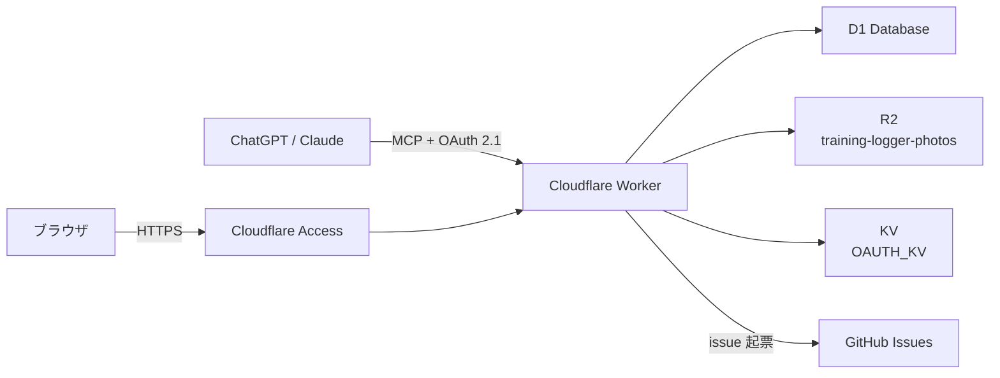

# training-logger

手書きの筋トレノートを、AI チャット経由でデジタル記録に変換する個人用トレーニングログシステム。

## ステータス

実装完了。`https://training-logger.discord.jp` で本番運用中。改善は [GitHub issue 駆動](https://github.com/japan4415/training-logger/issues) で継続する。

> **認証**: Web UI / REST API は Cloudflare Access で、MCP（`/mcp`）は OAuth 2.1（`@cloudflare/workers-oauth-provider`）で保護する。どちらもログインした Access アカウントを内部ユーザー ID に解決し、記録・写真は自分に帰属するものだけを返す。設定手順は [docs/deployment.md](docs/deployment.md) を参照。

## 特徴

- **AI チャットから記録**: ChatGPT・Claude に話しかけるだけで筋トレを記録（MCP 接続）
- **ノート写真も OK**: 手書きノートの写真を送れば LLM が読み取って構造化・登録（Claude 向け登録手順 Skill も提供）
- **元の写真も保存**: 登録に使ったノート写真を R2 に保存し、セッション詳細から振り返り可能
- **Web で振り返り**: 過去の記録をブラウザで閲覧。種目別の推移をチャートで確認し、鍛えた部位を人体（Human Atlas）の 3D 表示で可視化
- **自分の記録だけ**: ログインユーザーに紐づく記録・写真だけを表示・操作する（招待制。オーナーが許可したアカウントだけがログインできる）
- **チャットから改善要望**: 「こんな機能がほしい」と言えば `create_feedback` で GitHub issue を起票（`GITHUB_TOKEN` 設定時は自動起票、未設定時は手動起票用 URL を案内）。アプリ自体が進化する
- **Cloudflare 無料枠で運用**: Workers + D1 + R2 + KV。招待した少人数の利用なら完全無料

## アーキテクチャ概要



## ドキュメント

| ドキュメント | 内容 |
|---|---|
| [docs/overview.md](docs/overview.md) | 背景・動機・ユーザーフロー・スコープ |
| [docs/architecture.md](docs/architecture.md) | 技術スタック・システム構成・認証・リクエストフロー・リポジトリ構成 |
| [docs/database.md](docs/database.md) | テーブル設計・ER 図・マイグレーション方針 |
| [docs/mcp-server.md](docs/mcp-server.md) | MCP ツール仕様・エンドポイント・各クライアントの接続手順 |
| [docs/skill.md](docs/skill.md) | 登録手順 Skill（Agent Skills）の仕様・導入・利用手順 |
| [docs/anatomy.md](docs/anatomy.md) | Atlasの筋肉カタログ・種目ごとの対応・出典 |
| [docs/web-ui.md](docs/web-ui.md) | Web UI 画面設計・SSR 構成・htmx による部分更新 |
| [docs/deployment.md](docs/deployment.md) | デプロイ手順・Cloudflare 設定・環境変数・CI/CD |
| [docs/development.md](docs/development.md) | ローカル開発・テスト・lint・issue 駆動開発フロー |
| [docs/roadmap.md](docs/roadmap.md) | フェーズ計画・将来の拡張構想 |

## クイックスタート

### 前提条件

- Node.js 22 または 24 LTS（CI は 22。`node -v`）
- pnpm（`corepack enable` で有効化。本リポジトリは `packageManager: pnpm@10.34.6` を指定しており corepack が該当版を自動取得する。corepack が同梱されない Node.js 25 以降では `npm install -g corepack` を先に実行する）

### 手順

```bash
git clone https://github.com/japan4415/training-logger.git
cd training-logger
pnpm install
pnpm exec wrangler d1 migrations apply training-logger-db --local
pnpm run dev
```

`pnpm run dev` は `wrangler dev` を起動し、既定で http://localhost:8787 で待ち受ける。ローカル D1 / R2 / KV はエミュレートされ、本番リソースには接続しない。マイグレーションは dev 起動前に適用する（先に dev を起動すると空の DB になる）。

ローカルには Cloudflare Access がないため、`.dev.vars` を用意しないと認証必須のパス（Web UI / REST API / `/authorize`）は 401 `access_not_configured` を返す。開発時は `.dev.vars` を作成して `PHOTO_UPLOAD_ALLOW_UNAUTHENTICATED=1` を有効にする。

```bash
cp .dev.vars.example .dev.vars
```

このフラグは Host が `localhost` / `127.0.0.1`（ポート付き可）のときだけ効き、リクエストを既定ユーザー（`users.id = 1`）として扱う。本番では設定しない。`.dev.vars.example` にはほかに次の項目がある:

- `create_feedback` を試す場合、`GITHUB_TOKEN=github_pat_xxx` のプレースホルダ行は truthy のためそのままでは GitHub API が 401 になる。実際の fine-grained PAT（`Issues: Read and write`）に置き換えると `GITHUB_REPO_OWNER` / `GITHUB_REPO_NAME` の先へ実際に起票される（既定は本番リポジトリ。試さない場合は行を削除すると手動起票 URL の案内にフォールバックする）
- `OAUTH_CONSENT_SECRET` は同意画面の CSRF トークンに使う HMAC 鍵。本番では必須（未設定だと同意フローが 503 で fail-closed）。ローカル開発フォールバック（`PHOTO_UPLOAD_ALLOW_UNAUTHENTICATED=1` + `ACCESS_*` 未設定）では固定のダミー鍵が使われるため設定は不要

### 動作確認

別ターミナルで:

```bash
curl -s http://localhost:8787/health        # {"status":"ok"}
curl -s http://localhost:8787/.well-known/oauth-protected-resource/mcp
curl -s http://localhost:8787/api/sessions   # {"sessions":[],"total":0}
curl -s http://localhost:8787/api/exercises  # {"exercises":[]}
curl -s -o /dev/null -w '%{http_code}\n' http://localhost:8787/          # 200
curl -s http://localhost:8787/exercises | grep -o '<title>[^<]*</title>' # 種目一覧
curl -s -o /dev/null -w '%{http_code}\n' -X POST http://localhost:8787/mcp \
  -H 'Content-Type: application/json' \
  -H 'Accept: application/json, text/event-stream' \
  -d '{"jsonrpc":"2.0","id":1,"method":"initialize","params":{"protocolVersion":"2025-06-18","capabilities":{},"clientInfo":{"name":"curl","version":"0.0.1"}}}'
```
> `/health` 以外の Web / REST は `.dev.vars` の `PHOTO_UPLOAD_ALLOW_UNAUTHENTICATED=1` が無いと 401 になる。`/mcp` は OAuth access token が無いとクライアント種別にかかわらず 401 と `WWW-Authenticate: Bearer resource_metadata=".../.well-known/oauth-protected-resource/mcp"` を返す（トークン無しの `initialize` は通らない）。

> ローカル D1 は空のため `/api/exercises` は `[]`、`/exercises/:id` は 404 を返す。本番 DB のデータはローカルへ同期されない。

## MCP 接続

本システムは MCP（Model Context Protocol）サーバとして動作し、3 種類のクライアントから接続できます。

| クライアント | 接続方式 |
|---|---|
| ChatGPT | Developer Mode Connector（remote HTTPS、OAuth 2.1） |
| claude.ai | Custom Connector（remote HTTPS、OAuth 2.1） |
| Claude Desktop | リモートコネクタ（推奨）または mcp-remote ブリッジ（OAuth 2.1） |

接続時にブラウザで `/authorize` が開き、Cloudflare Access にログインしてから同意画面で許可する。認可サーバーは Cloudflare Access を上流 IdP とし、redirect_uri のホストを許可リストで限定する。詳細な接続手順は [docs/mcp-server.md](docs/mcp-server.md) を参照してください。

また、Claude（claude.ai / Claude Code）向けに、手書きノート写真からの登録を安全・確実に行う手順 Skill（`log-workout`）を提供しています。導入手順は [docs/skill.md](docs/skill.md) を参照してください。

## 開発フロー

issue 駆動開発を採用しています。

1. 改善要望はチャットから `create_feedback` ツールで issue 化
2. issue を元に feature ブランチで実装
3. PR 作成 → CI 通過 → merge で自動デプロイ

詳細は [docs/development.md](docs/development.md) を参照してください。
