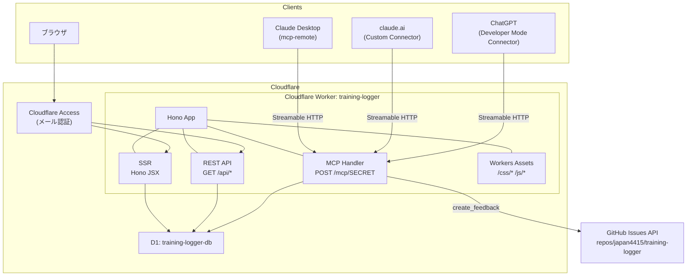
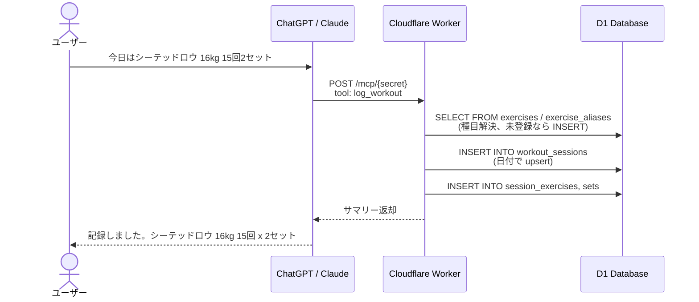
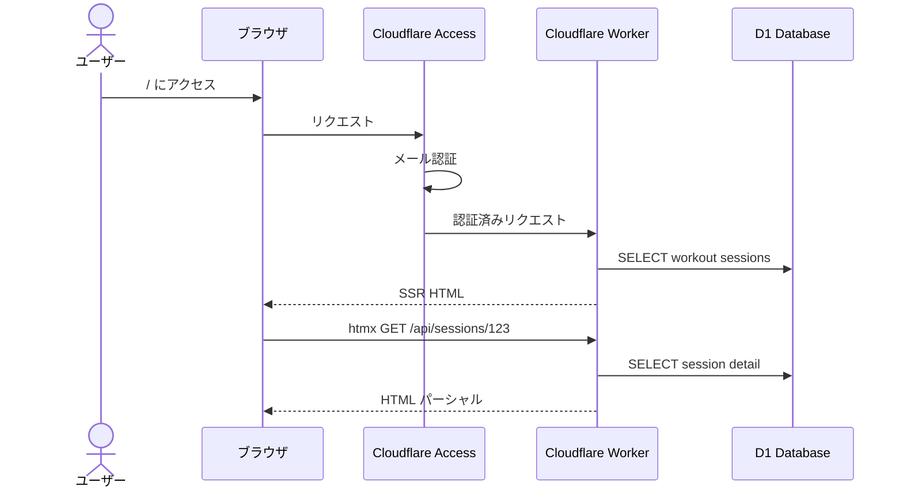
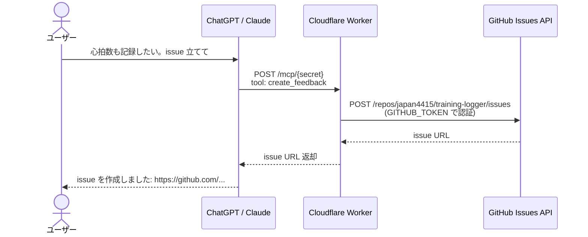

# アーキテクチャ

## 技術スタック

### 決定一覧

| カテゴリ | 選定 | 備考 |
|---|---|---|
| ランタイム | Cloudflare Workers | ステートレス、エッジ実行 |
| フレームワーク | Hono v4.x | MCP / REST / SSR / 静的配信を単一 Worker で統合 |
| データベース | Cloudflare D1 | エッジ SQLite。[無料枠](https://developers.cloudflare.com/d1/platform/pricing/): 5GB / 読み 500万行/日 / 書き 10万行/日 |
| 静的配信 | Workers Assets | `wrangler.jsonc` の `assets.directory` で設定。[2026年現在 Pages より Workers + Assets が Cloudflare 推奨](https://developers.cloudflare.com/workers/static-assets/) |
| MCP SDK | `@modelcontextprotocol/sdk` v1.30.x (stable) | `McpServer` + `registerTool` + Zod でツール定義 |
| MCP トランスポート | Streamable HTTP（ステートレス） | Hono ミドルウェアとして実装 |
| MCP プロトコルバージョン | `2025-11-25`（現行安定版） | `2026-07-28` RC の stable 化後に移行検討 |
| Web UI 保護 | Cloudflare Access (Zero Trust) | 無料枠 50 シート |
| 言語 | TypeScript (strict) | |
| パッケージマネージャ | pnpm | Renovate（リポジトリで有効化済み）と相性良好 |
| ビルド | wrangler (esbuild 内蔵) | |
| テスト | Vitest + `@cloudflare/vitest-pool-workers` | D1 バインディングを実際に使ってテスト可能 |
| lint / format | Biome | ESLint + Prettier の統合代替 |
| スキーマ検証 | Zod | MCP ツール入力定義と共用 |
| Web UI | Hono JSX (SSR) + htmx | SPA フレームワーク不使用 |
| チャート | Chart.js（CDN 読み込み） | |

### ADR: 却下した代替案

| 代替案 | 却下理由 |
|---|---|
| Python + FastMCP + Fly.io | remote MCP 必須要件下で Workers の方が運用コスト・無料枠・デプロイ容易性で優位。Fly.io に D1 相当の無料 DB がない |
| 完全ローカル (stdio MCP のみ) | ChatGPT・claude.ai は公開 HTTPS エンドポイント必須のため接続不可。Claude Desktop のみになり要件を満たさない |
| Deno Deploy | D1 相当のリレーショナルなエッジ DB がない |
| Supabase + Vercel | 2 サービス管理が必要。Cloudflare なら単一プラットフォームで完結 |
| McpAgent (Durable Objects) | [deprecated・feature-frozen](https://developers.cloudflare.com/agents/model-context-protocol/apis/agent-api/)。[ステートレス実装が現在の推奨](https://blog.cloudflare.com/mcp-v2/) |
| React / Vue SPA | 個人用ビューアに過剰。SSR + htmx で十分。ビルドステップ削減で CI も速い |
| MCP SDK v2 beta | ESM only の beta。breaking change リスク。v1 stable で十分 |

## システム構成



単一の Cloudflare Worker 内で Hono が以下の 4 つの役割を統合する:

- **MCP Handler**: `POST /mcp/{MCP_SECRET}` で MCP クライアントからのリクエストを処理
- **REST API**: `GET /api/*` で Web UI 向けのデータ取得エンドポイントを提供（読み取り専用）
- **SSR**: Hono JSX でサーバサイドレンダリング。`/` をルートとしてページを配信
- **Workers Assets**: `public/` ディレクトリの静的ファイルをサイトルートで配信（例: `/css/style.css`, `/js/chart-init.js`）

## 認証設計

### フェーズ 1（初期リリース）: シークレットパス方式

| リソース | 保護方式 |
|---|---|
| `POST /mcp/{MCP_SECRET}` | シークレットパス（Access は Bypass ポリシー） |
| `/`, `/api/*` | Cloudflare Access（Email 許可リスト） |
| `/css/*`, `/js/*`（静的） | 公開 |
| GitHub API 呼び出し | PAT（Workers Secrets `GITHUB_TOKEN`） |

**MCP エンドポイント**:

- `MCP_SECRET` は Workers Secrets で管理する推測不能な文字列
- ChatGPT / claude.ai には「認証なし (no-auth)」モードで URL ごと登録
- 不正な secret には **404** を返す（403 でなく 404 でエンドポイントの存在を隠す）
- GET リクエストには **405** を返す
- 漏洩時は Secret ローテーションで即無効化

**根拠**: 個人利用で OAuth 2.1 IdP を構築するのは過剰。HTTPS + 推測不能 URL で実用上十分。

**Cloudflare Access の構成**:

Access アプリケーションを 2 つ作成する:

1. `/mcp/*` に **Bypass** ポリシー: MCP クライアントは Access 認証を通過できないため
2. それ以外（`/`, `/api/*`）に **Email 許可リスト** ポリシー: 個人のメールアドレスのみ許可

**将来パス**: `@cloudflare/workers-oauth-provider` による OAuth 2.1 (PKCE + CIMD) 化を Phase 3 以降に位置づけ。

## リクエストフロー

### 1. 記録登録

ユーザーが「今日はシーテッドロウ 16kg 15回2セットやった」とチャットで伝えた場合:



### 2. Web 閲覧



### 3. issue 起票

ユーザーが「心拍数も記録したい、要望として issue 立てて」とチャットで伝えた場合:



## リポジトリ構成

```
training-logger/
├── README.md                    # プロジェクト概要・ドキュメント目次
├── CLAUDE.md                    # Claude Code 向けプロジェクト指示
├── docs/
│   ├── overview.md              # 背景・動機・ユーザーフロー・スコープ
│   ├── architecture.md          # 技術スタック・システム構成・認証・リクエストフロー
│   ├── database.md              # テーブル設計・ER 図・マイグレーション方針
│   ├── mcp-server.md            # MCP ツール仕様・エンドポイント・接続手順
│   ├── web-ui.md                # Web UI 画面設計・SSR 構成
│   ├── deployment.md            # デプロイ手順・Cloudflare 設定・CI/CD
│   ├── development.md           # ローカル開発・テスト・lint
│   └── roadmap.md               # フェーズ計画・将来構想
├── src/
│   ├── index.ts                 # Hono app エントリポイント、ルーティング統合
│   ├── env.ts                   # Bindings 型定義 (DB, MCP_SECRET, GITHUB_TOKEN)
│   ├── db/                      # データアクセス層
│   │   ├── schema.ts            # テーブル定義の TypeScript 型
│   │   ├── exercises.ts         # 種目の CRUD・別名解決
│   │   ├── sessions.ts          # セッションの CRUD
│   │   ├── records.ts           # セット記録の CRUD
│   │   └── queries.ts           # 集計・検索クエリ
│   ├── mcp/
│   │   ├── handler.ts           # Streamable HTTP ハンドラ (Hono ミドルウェア)
│   │   ├── server.ts            # McpServer 生成・ツール登録集約
│   │   └── tools/               # 各 MCP ツールの実装
│   │       ├── search-exercises.ts
│   │       ├── register-exercise.ts
│   │       ├── log-workout.ts
│   │       ├── update-workout.ts
│   │       ├── delete-workout.ts
│   │       ├── get-history.ts
│   │       └── create-feedback.ts
│   ├── api/                     # REST API (Web UI 向け、読み取り専用)
│   │   ├── routes.ts            # API ルーティング
│   │   ├── sessions.ts          # セッション一覧・詳細
│   │   ├── exercises.ts         # 種目一覧
│   │   └── stats.ts             # 統計・集計
│   └── views/                   # SSR (Hono JSX)
│       ├── layout.tsx           # 共通レイアウト
│       ├── sessions-list.tsx    # セッション一覧ページ
│       ├── session-detail.tsx   # セッション詳細ページ
│       ├── exercise-progress.tsx # 種目別推移ページ
│       ├── exercises-list.tsx   # 種目一覧ページ
│       └── components/          # 共通コンポーネント
├── public/                      # Workers Assets (サイトルートで配信)
│   ├── css/
│   │   └── style.css
│   └── js/
│       └── chart-init.js
├── migrations/                  # D1 マイグレーション
│   ├── 0001_initial_schema.sql
│   └── README.md
├── test/                        # Vitest テスト
│   ├── db/                      # データアクセス層のテスト
│   ├── mcp/                     # MCP ツールのテスト
│   └── api/                     # REST API のテスト
├── .github/
│   ├── workflows/
│   │   ├── ci.yml               # CI (typecheck, lint, test)
│   │   └── deploy.yml           # CD (Cloudflare Workers デプロイ)
│   └── ISSUE_TEMPLATE/
├── wrangler.jsonc               # Cloudflare Workers 設定
├── tsconfig.json
├── biome.json
├── vitest.config.ts
├── package.json
└── renovate.json                # Renovate 自動依存更新設定
```

### ディレクトリの責務

**`src/db/`** - データアクセス層。ビジネスロジックの本体。SQL を直接記述し（ORM 不使用）、D1 の SQLite 方言を活用する。ORM を使わない理由は、D1 の SQLite 方言との相性問題を回避するため。

**`src/mcp/`** - MCP サーバの実装。各ツールは薄く保ち、入力バリデーション（Zod）とレスポンス整形のみを担当する。ビジネスロジックは `db/` に委譲する。

**`src/api/`** - Web UI 向けの REST API。読み取り専用。htmx からのリクエストに HTML パーシャルを返す。

**`src/views/`** - Hono JSX によるサーバサイドレンダリング。htmx 属性を埋め込んだ HTML を生成する。

**`public/`** - Workers Assets で配信される静的ファイル。`/static` プレフィックスは使わず、サイトルートから直接配信する（例: `/css/style.css`）。

**`migrations/`** - D1 のマイグレーション SQL。`wrangler d1 migrations apply` で適用する。

**`test/`** - `@cloudflare/vitest-pool-workers` を使用し、実際の D1 バインディングでテストを実行する。

## 将来の拡張パス

### OAuth 2.1 化

Phase 3 以降で `@cloudflare/workers-oauth-provider` を導入し、標準的な MCP 認証（OAuth 2.1 + PKCE + CIMD）に移行する。これにより:

- シークレットパス方式を廃止し、トークンベースの認証に移行
- ChatGPT / claude.ai の OAuth 対応を活用した正式な認可フロー
- 将来的な複数ユーザー対応の基盤

### MCP プロトコル更新

MCP プロトコルバージョン `2026-07-28` が stable 化した時点で移行を検討する。現行の `2025-11-25` との差分を評価し、breaking change がなければ更新する。
