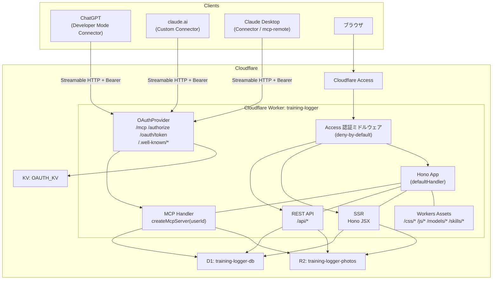
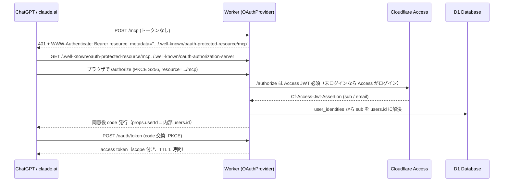
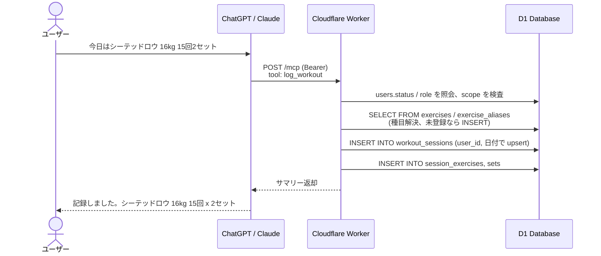
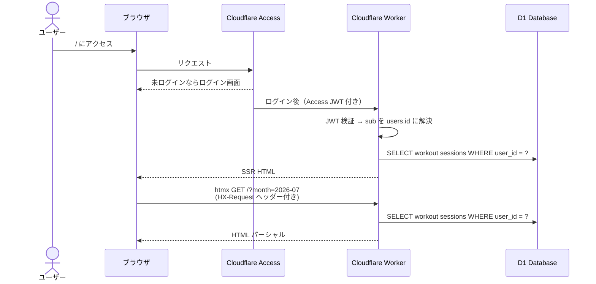

# アーキテクチャ

## 技術スタック

### 決定一覧

| カテゴリ | 選定 | 備考 |
|---|---|---|
| ランタイム | Cloudflare Workers | ステートレス、エッジ実行 |
| フレームワーク | Hono v4.x | MCP / REST / SSR / 静的配信を単一 Worker で統合 |
| データベース | Cloudflare D1 | エッジ SQLite。[無料枠](https://developers.cloudflare.com/d1/platform/pricing/): 5GB / 読み 500万行/日 / 書き 10万行/日 |
| オブジェクトストレージ | Cloudflare R2 | `training-logger-photos` にセッション写真を保存。新規は `users/{userId}/sessions/{YYYY-MM-DD}/{sessionId}/{uuid}.{ext}` 形式。D1 はメタデータだけを保持 |
| ブラウザ認証 | Cloudflare Access | custom domain 全体を deny-by-default で保護。検証済み `sub` を内部 `users.id` に解決する |
| OAuth 状態ストア | Cloudflare KV | `OAUTH_KV` に OAuth 2.1 の client / grant / token を保存 |
| MCP 認可 | `@cloudflare/workers-oauth-provider` | OAuth 2.1 + PKCE (S256) + CIMD。上流 IdP は Cloudflare Access。`/mcp` を access token 必須にする |
| ユーザー分離 | D1 `users` / `user_identities` | 外部 IdP の `sub` を直接使わず、内部 INTEGER `user_id` でデータを所有する |
| 静的配信 | Workers Assets | `wrangler.jsonc` の `assets.directory` で設定。[2026年現在 Pages より Workers + Assets が Cloudflare 推奨](https://developers.cloudflare.com/workers/static-assets/) |
| MCP SDK | `@modelcontextprotocol/sdk` v1.30.x (stable) | `McpServer` + `registerTool` + Zod でツール定義 |
| MCP トランスポート | Streamable HTTP（ステートレス） | Hono ルートとして実装 |
| MCP プロトコルバージョン | `2025-11-25`（現行安定版） | `2026-07-28` RC の stable 化後に移行検討 |
| 言語 | TypeScript (strict) | |
| パッケージマネージャ | pnpm | Renovate（リポジトリで有効化済み）と相性良好 |
| ビルド | wrangler (esbuild 内蔵) | |
| テスト | Vitest + `@cloudflare/vitest-pool-workers` | D1 バインディングを実際に使ってテスト可能 |
| lint / format | Biome | ESLint + Prettier の統合代替 |
| スキーマ検証 | Zod | MCP ツール入力定義と共用 |
| Web UI | Hono JSX (SSR) + htmx | SPA フレームワーク不使用 |
| チャート | Chart.js（CDN 読み込み） | |

### ADR: 却下した代替案

| 代替案 | 却下理由 |
|---|---|
| Python + FastMCP + Fly.io | remote MCP 必須要件下で Workers の方が運用コスト・無料枠・デプロイ容易性で優位。Fly.io に D1 相当の無料 DB がない |
| 完全ローカル (stdio MCP のみ) | ChatGPT・claude.ai は公開 HTTPS エンドポイント必須のため接続不可。Claude Desktop のみになり要件を満たさない |
| Deno Deploy | D1 相当のリレーショナルなエッジ DB がない |
| Supabase + Vercel | 2 サービス管理が必要。Cloudflare なら単一プラットフォームで完結 |
| McpAgent (Durable Objects) | [deprecated・feature-frozen](https://developers.cloudflare.com/agents/model-context-protocol/apis/agent-api/)。[ステートレス実装が現在の推奨](https://blog.cloudflare.com/mcp-v2/) |
| React / Vue SPA | 個人用ビューアに過剰。SSR + htmx で十分。ビルドステップ削減で CI も速い |
| MCP SDK v2 beta | ESM only の beta。breaking change リスク。v1 stable で十分 |
| Access Managed OAuth（MCP） | ChatGPT / claude.ai の実コネクタ接続の一次情報がなく、CIMD / DCR の対応も未確認。CIMD / PKCE S256 / resource→aud を明示的に満たす `@cloudflare/workers-oauth-provider` を採用 |
| GCP（Firebase / Identity Platform）で ID 基盤を置換 | 個人〜少人数では 2 クラウド管理に見合わない。AS とコンピュートを Cloudflare に残せる |

## システム構成


```mermaid
graph TB
    subgraph Clients
        ChatGPT["ChatGPT<br/>(Developer Mode Connector)"]
        ClaudeAI["claude.ai<br/>(Custom Connector)"]
        ClaudeDesktop["Claude Desktop<br/>(Connector / mcp-remote)"]
        Browser["ブラウザ"]
    end

    subgraph Cloudflare
        Access["Cloudflare Access"]
        subgraph Worker["Cloudflare Worker: training-logger"]
            OAuthProvider["OAuthProvider<br/>/mcp /authorize /oauth/token<br/>/.well-known/*"]
            HonoApp["Hono App<br/>(defaultHandler)"]
            AccessMdw["Access 認証ミドルウェア<br/>(deny-by-default)"]
            MCP["MCP Handler<br/>createMcpServer(userId)"]
            REST["REST API<br/>/api/*"]
            SSR["SSR<br/>Hono JSX"]
            Assets["Workers Assets<br/>/css/* /js/* /models/* /skills/*"]
        end

        D1["D1: training-logger-db"]
        R2["R2: training-logger-photos"]
        KV["KV: OAUTH_KV"]
    end

    ChatGPT -->|"Streamable HTTP + Bearer"| OAuthProvider
    ClaudeAI -->|"Streamable HTTP + Bearer"| OAuthProvider
    ClaudeDesktop -->|"Streamable HTTP + Bearer"| OAuthProvider
    OAuthProvider --> MCP

    Browser --> Access
    Access --> AccessMdw
    AccessMdw --> REST
    AccessMdw --> SSR
    AccessMdw --> HonoApp

    HonoApp --- MCP
    HonoApp --- REST
    HonoApp --- SSR
    HonoApp --- Assets

    MCP --> D1
    MCP --> R2
    REST --> D1
    REST --> R2
    SSR --> D1
    SSR --> R2
    OAuthProvider --> KV
```

単一の Cloudflare Worker 内で役割を統合する:

- **OAuthProvider**: `/mcp` を access token 必須の API として処理する。`/authorize`（同意画面）と `/oauth/token`・`/oauth/register`（有効時）・`/.well-known/*` もここで扱い、それ以外は `defaultHandler` の Hono アプリへ流す
- **MCP Handler**: 検証済みの `ctx.props.userId` と `ctx.auth.scope` で、リクエストごとに `createMcpServer` を生成してツールを実行する
- **REST API**: `GET /api/*` で Web UI 向けデータを取得し、写真 API は GET / POST / DELETE を扱う
- **SSR**: Hono JSX でサーバサイドレンダリング。`/` をルートとしてページを配信
- **Workers Assets**: `public/` ディレクトリの静的ファイルをサイトルートで配信（例: `/css/style.css`, `/js/chart-init.js`）

### 認証と認可

#### Web / REST（Cloudflare Access）

custom domain 全体を Access の Allow ポリシー（deny-by-default）で保護する。Worker 側にも `registerAccessAuth` による deny-by-default の認証ミドルウェアを置き、edge の設定漏れがあっても fail-closed にする。公開パスは `/oauth/*`・`/.well-known/*`・`/skills/*`・静的アセット（`/css` `/js` `/models` `/favicon.ico` `/robots.txt`）だけで、それ以外（`/`・`/sessions/*`・`/api/*`・`/exercises*` など）は Access JWT を必須とする。

認証は `Cf-Access-Jwt-Assertion` ヘッダー、なければ `CF_Authorization` cookie から取得した JWT を、Access JWKS で RS256 署名・`iss`・`aud`・`exp`・`nbf` を検証する。検証後、`sub` を `user_identities` 経由で内部 `users.id` に解決し、`c.set("userId", ...)` する。未登録（招待行なし）・`users.status = 'disabled'` は 403 で拒否する。書き込み系（GET / HEAD / OPTIONS 以外）は `Sec-Fetch-Site` による CSRF 検査を追加する。`/authorize` は Access JWT 必須のまま残し、失敗は同意画面の HTML で表示する。

`ACCESS_TEAM_DOMAIN` / `ACCESS_AUD` が未設定のときは、`localhost` / `127.0.0.1` かつ `PHOTO_UPLOAD_ALLOW_UNAUTHENTICATED=1` の開発フォールバック（既定ユーザー `user 1`）だけを許可し、それ以外は 401 `access_not_configured` で fail-closed にする。有効化手順は [deployment.md](./deployment.md) を参照。

#### MCP（OAuth 2.1）

`/mcp` は `@cloudflare/workers-oauth-provider` の `OAuthProvider` が access token を検証してから `apiHandler` へ渡す。MCP クライアントは次の discovery で接続する:

| エンドポイント | 用途 |
|---|---|
| `/.well-known/oauth-protected-resource/mcp` | PRM。`resource`・`authorization_servers`・`scopes_supported`（`mcp:read` のみ）を返す |
| `/.well-known/oauth-authorization-server` | AS metadata。`offline_access` を含む全 scope と `client_id_metadata_document_supported` を返す |
| `/authorize` | 同意画面（Access JWT 必須）。承認すると `props.userId`（内部 `users.id`）を grant に束縛する |
| `/oauth/token` | authorization code（PKCE S256）と refresh token の交換 |
| `/oauth/register` | DCR（RFC 7591）。`OAUTH_DCR_ENABLED=1` のときだけ公開する |

- 未認証の `/mcp` は 401 と `WWW-Authenticate: Bearer resource_metadata="..."` を返す。
- scope は `mcp:read` / `mcp:write` / `photos:write`。ツール単位で必要 scope を検査し、不足時は 403 `insufficient_scope` で step-up を促す（challenge の `scope` は現在の scope と不足分の和集合）。`offline_access` は AS metadata にだけ載せる。
- access token は 1 時間、refresh token（grant）は 30 日で使用時に回転する。`apiHandler` は毎リクエスト `users.status` / `users.role` を D1 で照会し、`disabled`・不在なら 401 にする。
- DCR は既定で無効。redirect_uri / CIMD `client_id` のホストは許可リスト（既定 `chatgpt.com` / `claude.ai` / `claude.com`。`OAUTH_ALLOWED_REDIRECT_HOSTS` で上書き）で判定する。

`wrangler.jsonc` は `workers_dev: false` に設定済みで、`*.workers.dev` URL を無効化している。配信経路は custom domain だけに限定する。

Access ポリシーは custom domain に対して設定される。`wrangler.jsonc` は `workers_dev: false` に設定済みで、`*.workers.dev` URL を無効化している。画像取得 URL を含め、配信経路は custom domain だけに限定する。

## リクエストフロー

### 1. MCP 接続（OAuth 2.1）

MCP クライアントが初めて接続するときの認可フロー:


```mermaid
sequenceDiagram
    participant C as ChatGPT / claude.ai
    participant W as Worker (OAuthProvider)
    participant A as Cloudflare Access
    participant D1 as D1 Database

    C->>W: POST /mcp (トークンなし)
    W-->>C: 401 + WWW-Authenticate: Bearer resource_metadata=".../.well-known/oauth-protected-resource/mcp"
    C->>W: GET /.well-known/oauth-protected-resource/mcp, /.well-known/oauth-authorization-server
    C->>W: ブラウザで /authorize (PKCE S256, resource=.../mcp)
    W->>A: /authorize は Access JWT 必須（未ログインなら Access がログイン）
    A-->>W: Cf-Access-Jwt-Assertion (sub / email)
    W->>D1: user_identities から sub を users.id に解決
    W-->>C: 同意後 code 発行（props.userId = 内部 users.id）
    C->>W: POST /oauth/token (code 交換, PKCE)
    W-->>C: access token（scope 付き、TTL 1 時間）
```

### 2. 記録登録（MCP）

ユーザーが「今日はシーテッドロウ 16kg 15回2セットやった」とチャットで伝えた場合:


```mermaid
sequenceDiagram
    actor User as ユーザー
    participant LLM as ChatGPT / Claude
    participant Worker as Cloudflare Worker
    participant D1 as D1 Database

    User->>LLM: 今日はシーテッドロウ 16kg 15回2セット
    LLM->>Worker: POST /mcp (Bearer)<br/>tool: log_workout
    Worker->>D1: users.status / role を照会、scope を検査
    Worker->>D1: SELECT FROM exercises / exercise_aliases<br/>(種目解決、未登録なら INSERT)
    Worker->>D1: INSERT INTO workout_sessions (user_id, 日付で upsert)
    Worker->>D1: INSERT INTO session_exercises, sets
    Worker-->>LLM: サマリー返却
    LLM-->>User: 記録しました。シーテッドロウ 16kg 15回 x 2セット
```

### 3. Web 閲覧


```mermaid
sequenceDiagram
    actor User as ユーザー
    participant Browser as ブラウザ
    participant Access as Cloudflare Access
    participant Worker as Cloudflare Worker
    participant D1 as D1 Database

    User->>Browser: / にアクセス
    Browser->>Access: リクエスト
    Access-->>Browser: 未ログインならログイン画面
    Access->>Worker: ログイン後（Access JWT 付き）
    Worker->>Worker: JWT 検証 → sub を users.id に解決
    Worker->>D1: SELECT workout sessions WHERE user_id = ?
    Worker-->>Browser: SSR HTML
    Browser->>Worker: htmx GET /?month=2026-07<br/>(HX-Request ヘッダー付き)
    Worker->>D1: SELECT workout sessions WHERE user_id = ?
    Worker-->>Browser: HTML パーシャル
```

## リポジトリ構成

```
training-logger/
├── README.md                    # プロジェクト概要・ドキュメント目次
├── CLAUDE.md                    # Claude Code 向けプロジェクト指示
├── docs/
│   ├── overview.md              # 背景・動機・ユーザーフロー・スコープ
│   ├── architecture.md          # 技術スタック・システム構成・リクエストフロー
│   ├── database.md              # テーブル設計・ER 図・マイグレーション方針
│   ├── mcp-server.md            # MCP ツール仕様・エンドポイント・接続手順
│   ├── skill.md                 # 登録手順 Skill の仕様・導入・利用手順
│   ├── anatomy.md               # Atlas の筋肉カタログ・種目対応・出典
│   ├── web-ui.md                # Web UI 画面設計・SSR 構成
│   ├── deployment.md            # デプロイ手順・Cloudflare 設定・CI/CD
│   ├── development.md           # ローカル開発・テスト・lint
│   └── roadmap.md               # フェーズ計画・将来構想
├── src/
│   ├── index.ts                 # Hono app エントリポイント、OAuthProvider の遅延生成
│   ├── env.ts                   # Bindings / Variables 型定義 (D1 / R2 / KV / OAuth / Access / GitHub)
│   ├── default-user.ts          # 開発フォールバックの既定ユーザー ID
│   ├── domain/
│   │   ├── atlas.ts             # Atlas カタログ・割当の検証/集約
│   │   └── atlas-profiles.json  # 初期プロファイル（14 種目の ID と出典）
│   ├── security/
│   │   ├── auth.ts              # deny-by-default ミドルウェア、sub → users.id 解決、公開パス判定
│   │   └── access-auth.ts       # Access JWT 検証（RS256 / iss / aud / exp / nbf）と CSRF 防止
│   ├── oauth/                   # MCP の OAuth 2.1 認可サーバー
│   │   ├── provider.ts          # OAuthProvider オプション（PRM / AS metadata / scope / DCR）
│   │   ├── config.ts            # issuer / resource / scope / redirect 許可リスト
│   │   ├── api-handler.ts       # /mcp の認可付きハンドラ（scope・status 検査）
│   │   ├── authorize.tsx        # /authorize 同意画面（CSRF・CSP・redirect 検証）
│   │   ├── csrf.ts              # 同意 POST の CSRF トークン
│   │   └── revocation.ts        # grant 失効ヘルパー
│   ├── db/                      # データアクセス層
│   │   ├── types.ts             # テーブル定義の TypeScript 型
│   │   ├── users.ts             # users / user_identities の解決
│   │   ├── exercises.ts         # 種目の CRUD・別名解決
│   │   ├── sessions.ts          # セッションの CRUD（user_id 必須）
│   │   ├── session-photos.ts    # 写真メタデータ、R2 保存・補償削除
│   │   ├── records.ts           # セット記録の CRUD
│   │   └── queries.ts           # 集計・検索クエリ
│   ├── mcp/
│   │   ├── server.ts            # McpServer 生成・ツール登録集約
│   │   ├── context.ts           # リクエストの userId / role / scope
│   │   ├── scopes.ts            # ツールごとの必要 scope 表
│   │   └── tools/               # 各 MCP ツールの実装
│   │       ├── exercises.ts     # search_exercises, register_exercise, list_atlas_muscles, set_exercise_muscles
│   │       ├── workouts.ts      # log_workout, update_workout, delete_workout
│   │       ├── photos.ts        # upload_session_photo, create_photo_upload_link
│   │       ├── history.ts       # get_history
│   │       ├── guard.ts         # ツール層の scope / role ガード
│   │       └── feedback.ts      # create_feedback
│   ├── api/                     # REST API (Web UI 向け)
│   │   ├── routes.ts            # API ルーティング
│   │   ├── sessions.ts          # セッション一覧・詳細
│   │   ├── photos.ts            # 写真一覧・本体配信・追加・削除
│   │   ├── exercises.ts         # 種目一覧・詳細
│   │   └── stats.ts             # 統計・集計
│   └── views/                   # SSR (Hono JSX)
│       ├── layout.tsx           # 共通レイアウト
│       ├── sessions-list.tsx    # セッション一覧ページ
│       ├── session-detail.tsx   # セッション詳細ページ
│       ├── exercise-progress.tsx # 種目別推移ページ
│       ├── exercises-list.tsx   # 種目一覧ページ
│       ├── consent.tsx          # OAuth 同意画面・エラーページ
│       └── components/          # 共通コンポーネント (session-card, set-table, chart, session-photos, muscle-map)
├── public/                      # Workers Assets (サイトルートで配信)
│   ├── css/
│   │   └── style.css
│   ├── js/
│   │   ├── chart-init.js
│   │   ├── session-photos.js    # 写真アップロード・削除 UI
│   │   ├── muscle-atlas.js      # Human Atlas 3D 表示
│   │   └── vendor/              # Three.js（本体 + ライセンス）
│   ├── models/human-atlas/      # 筋肉モデル (atlas.json, muscles.bin.gz, ATTRIBUTION.md, HUMAN-ATLAS-LICENSE.txt)
│   └── skills/                  # Skill 配布物 (log-workout.zip, log-workout/SKILL.md)
├── skills/
│   └── log-workout/
│       └── SKILL.md             # Skill 正本
├── scripts/
│   ├── build-skill.mjs          # 配布物生成
│   ├── import-human-atlas.mjs   # Human Atlas 取り込み
│   ├── import-bodyparts3d-v3.mjs # BodyParts3D 3.0 補完
│   ├── vendor-three.mjs         # Three.js 同梱
│   ├── generate-atlas-migration.mjs # Atlas 移行 SQL 生成
│   └── verify-bodyparts3d-registration.py # 位置合わせ検証
├── migrations/                  # D1 マイグレーション
│   ├── 0001_initial_schema.sql
│   ├── 0002_atlas_muscles.sql
│   ├── 0003_atlas_trunk_muscles.sql
│   ├── 0004_session_photos.sql
│   ├── 0005_users_and_user_id.sql # users / user_identities と 4 テーブル再構築
│   └── README.md
├── test/                        # Vitest テスト
│   ├── db/                      # データアクセス層のテスト
│   ├── domain/                  # Atlas 割当のテスト
│   ├── mcp/                     # MCP ハンドラ・ツールのテスト
│   ├── api/                     # REST API のテスト
│   ├── views/                   # SSR ビューのテスト
│   ├── oauth/                   # OAuthProvider / 同意画面 / token のテスト
│   ├── security/                # Access JWT 検証・認証ミドルウェアのテスト
│   └── fixtures/                # テストフィクスチャ
├── .claude/skills/log-workout   # リポジトリ内 Skill へのシンボリックリンク
├── .github/
│   ├── workflows/
│   │   └── ci.yml               # CI (typecheck, lint, D1 マイグレーション検証, test)
│   └── ISSUE_TEMPLATE/
│       └── feature-request.md
├── .dev.vars.example            # ローカル用の環境変数テンプレート
├── .gitignore
├── wrangler.jsonc               # Cloudflare Workers 設定
├── tsconfig.json
├── biome.json
├── vitest.config.ts
├── package.json
├── pnpm-lock.yaml
└── renovate.json                # Renovate 自動依存更新設定
```

### ディレクトリの責務

**`src/db/`** - データアクセス層。ビジネスロジックの本体。SQL を直接記述し（ORM 不使用）、D1 の SQLite 方言を活用する。ORM を使わない理由は、D1 の SQLite 方言との相性問題を回避するため。一部の SSR ビュー（種目進捗・種目一覧・前後セッション取得）は表示専用の集計 SQL をビュー内に直接持つ。

**`src/mcp/`** - MCP サーバの実装。各ツールは薄く保ち、入力バリデーション（Zod）・scope / role ガードとレスポンス整形のみを担当する。ビジネスロジックは `db/` に委譲する。ツールは `McpContext`（`userId` / `role` / `scopes`）を受け取り、`userId` を必須の引数として `db/` へ渡す。

**`src/api/`** - Web UI 向けの REST API。ワークアウトデータは読み取り専用で、セッション写真だけ追加・削除を扱う。htmx の部分更新は SSR ルート（`src/views/`）自身が `HX-Request` ヘッダーを検出して処理する。

**`src/oauth/`** - MCP の OAuth 2.1 認可サーバー。`OAuthProvider` のオプション（PRM / AS metadata / scope / DCR）、`/authorize` 同意画面、`/mcp` の認可付きハンドラ、grant 失効を担う。ここもユーザー識別は内部 `users.id` に統一する。

**`src/security/`** - Web / REST の Cloudflare Access JWT 検証（RS256 / `iss` / `aud` / `exp` / `nbf`）、deny-by-default ミドルウェア、Fetch Metadata による CSRF 防止を担う。`/oauth/*`（token・revocation・metadata・DCR）は公開パス、`/authorize` は Access JWT 必須とする。

**`src/views/`** - Hono JSX によるサーバサイドレンダリング。htmx 属性を埋め込んだ HTML と、OAuth 同意画面（`consent.tsx`）を生成する。

**`public/`** - Workers Assets で配信される静的ファイル。`/static` プレフィックスは使わず、サイトルートから直接配信する（例: `/css/style.css`）。

**`migrations/`** - D1 のマイグレーション SQL。`pnpm exec wrangler d1 migrations apply` で適用する。

**`test/`** - `@cloudflare/vitest-pool-workers` を使用し、実際の D1 バインディングでテストを実行する。

## 将来の拡張パス

### 認証・認可の拡張

OAuth 2.1 化と複数ユーザー対応は Issue #66 で実装済み。今後は次を検討する:

- `user_id DEFAULT 1` の撤去（全 INSERT の明示指定が徹底された後）
- 個人専用種目（`exercises.owner_user_id`）
- DCR を公開する場合の Rate Limiting / WAF
- Access for SaaS（OIDC）上流への切り替え（`/authorize` を Access 背後に置く構成が実機 PoC で成立しない場合）

### MCP プロトコル更新

MCP プロトコルバージョン `2026-07-28` が stable 化した時点で移行を検討する。現行の `2025-11-25` との差分を評価し、breaking change がなければ更新する。
