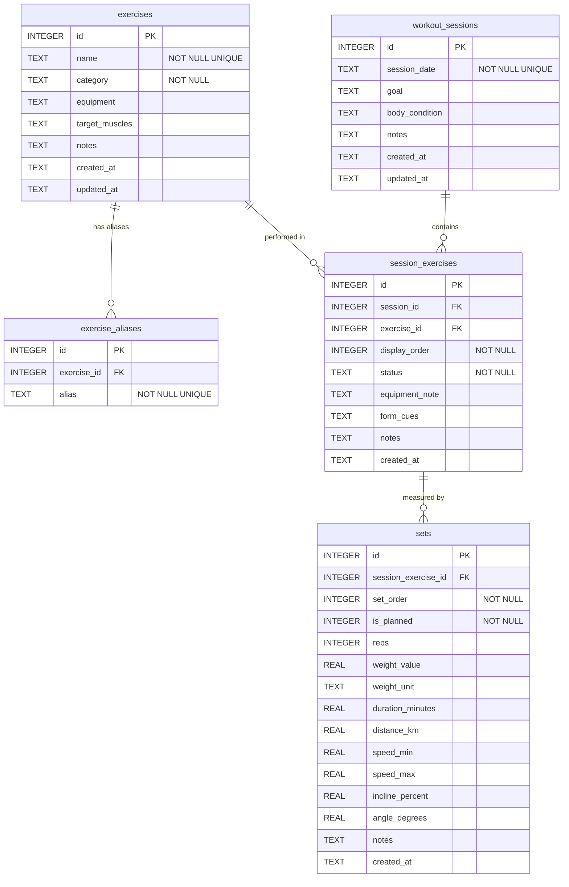

# データベース設計

training-logger のデータベース設計について記述する。DBMS は Cloudflare D1 (SQLite ベース) を使用する。

## 設計方針

ユーザー方針「筋トレの種類テーブル + 筋トレ内容テーブル」を核に、以下の 5 テーブルへ正規化する。

- **`exercises`** -- 種目マスタ。種目の正規名・カテゴリ・器具・対象部位を保持
- **`exercise_aliases`** -- 種目の別名（表記揺れ対策）
- **`workout_sessions`** -- ワークアウトセッション。1 日 1 行で日付・目的・体調メモを管理
- **`session_exercises`** -- セッション内の種目実施。順序付きで、同一種目の同日複数回出現に対応
- **`sets`** -- セット単位の計測値。筋力系・有酸素系・柔軟系のパラメータを NULL 許容カラムで持つ

### 単位の扱い

入力値をそのまま保持し、kg/lbs 間の変換は行わない。`sets.weight_unit` カラム (`kg` / `lbs` / `level`) で単位を記録する。`level` はカイザー空圧マシンなどのマシン抵抗レベルに使用し、自重種目では `weight_value` と `weight_unit` の両方が NULL になる。

### 範囲値

速度のように範囲で記録される値（例: 3.0~3.5 km/h）は `speed_min` / `speed_max` の 2 カラムで表現する。単一値の場合は min = max とする。

### 計画 vs 実績

`sets.is_planned` フラグ（0=実績, 1=計画）で区別する。詳細は [計画 vs 実績](#計画-vs-実績) セクションを参照。

### 曜日

曜日カラムは持たない。`session_date` から表示時に導出する。保存すると日付との矛盾リスクが生じるため、意図的に省略している。

### タイムゾーン

- 日付: `TEXT 'YYYY-MM-DD'` 形式。Asia/Tokyo の日付として記録する
- タイムスタンプ (`created_at`, `updated_at`): ISO 8601 UTC 形式 (`YYYY-MM-DDTHH:MM:SSZ`)
- アプリの実行環境（Cloudflare Workers）は UTC であるため、「今日」の算出は Intl API で Asia/Tokyo に変換して行う（実装方法は [mcp-server.md](./mcp-server.md) の log_workout の項を参照）

### D1 (SQLite) の型

SQLite のカラム型として `TEXT` / `INTEGER` / `REAL` を使用する。BOOLEAN は `INTEGER` (0/1) で表現する。

## ER 図



## テーブル定義

### exercises (種目マスタ)

種目の正規名称と属性を管理するマスタテーブル。

| カラム | 型 | 制約 | 説明 |
|---|---|---|---|
| `id` | INTEGER | PRIMARY KEY AUTOINCREMENT | 種目 ID |
| `name` | TEXT | NOT NULL COLLATE NOCASE UNIQUE | 正規名称（例: "シーテッドロウ"）。大文字小文字を区別しない一意制約 |
| `category` | TEXT | NOT NULL DEFAULT 'strength' | カテゴリ。`strength` / `cardio` / `flexibility` / `other` のいずれか |
| `equipment` | TEXT | | 器具（例: "カイザー空圧マシン"）。自重種目は NULL |
| `target_muscles` | TEXT | | 対象部位（例: "背中"） |
| `notes` | TEXT | | メモ |
| `created_at` | TEXT | NOT NULL DEFAULT (UTC) | 作成日時 ISO 8601 UTC |
| `updated_at` | TEXT | NOT NULL DEFAULT (UTC) | 更新日時 ISO 8601 UTC |

### exercise_aliases (種目別名)

表記揺れを吸収するための別名テーブル。1 つの種目に複数の別名を登録できる。

| カラム | 型 | 制約 | 説明 |
|---|---|---|---|
| `id` | INTEGER | PRIMARY KEY AUTOINCREMENT | 別名 ID |
| `exercise_id` | INTEGER | NOT NULL, FK -> exercises(id) ON DELETE CASCADE | 親種目 ID |
| `alias` | TEXT | NOT NULL COLLATE NOCASE UNIQUE | 別名（例: "Keiser Chest Press"）。大文字小文字を区別しない一意制約 |

インデックス:

- `idx_exercise_aliases_exercise_id` -- `exercise_id` で検索
- `idx_exercise_aliases_alias` -- `alias` (COLLATE NOCASE) で大文字小文字を区別しない検索

### workout_sessions (ワークアウトセッション)

1 日 1 行のセッション管理テーブル。

| カラム | 型 | 制約 | 説明 |
|---|---|---|---|
| `id` | INTEGER | PRIMARY KEY AUTOINCREMENT | セッション ID |
| `session_date` | TEXT | NOT NULL UNIQUE | セッション日付 'YYYY-MM-DD' (Asia/Tokyo) |
| `goal` | TEXT | | 目的（例: "ダイエット"） |
| `body_condition` | TEXT | | 体調・怪我メモ |
| `notes` | TEXT | | メモ |
| `created_at` | TEXT | NOT NULL DEFAULT (UTC) | 作成日時 ISO 8601 UTC |
| `updated_at` | TEXT | NOT NULL DEFAULT (UTC) | 更新日時 ISO 8601 UTC |

インデックス:

- `idx_workout_sessions_date` -- `session_date` で範囲検索・ソート

### session_exercises (セッション内種目実施)

セッション内で実施した種目を順序付きで管理する。同一種目が同日に複数回出現するケース（例: ウォーキングを最初と最後に実施）にも対応する。

| カラム | 型 | 制約 | 説明 |
|---|---|---|---|
| `id` | INTEGER | PRIMARY KEY AUTOINCREMENT | 種目実施 ID |
| `session_id` | INTEGER | NOT NULL, FK -> workout_sessions(id) ON DELETE CASCADE | セッション ID |
| `exercise_id` | INTEGER | NOT NULL, FK -> exercises(id) | 種目 ID |
| `display_order` | INTEGER | NOT NULL | セッション内の表示順 (1-based) |
| `status` | TEXT | NOT NULL DEFAULT 'completed' | 状態。`planned` / `completed` / `skipped` のいずれか |
| `equipment_note` | TEXT | | この実施での器具メモ（例: "木の台・小", "2kgバー"） |
| `form_cues` | TEXT | | フォームキュー（改行区切りで複数記録） |
| `notes` | TEXT | | メモ |
| `created_at` | TEXT | NOT NULL DEFAULT (UTC) | 作成日時 ISO 8601 UTC |

制約:

- `UNIQUE(session_id, display_order)` -- 同一セッション内で表示順は一意

インデックス:

- `idx_session_exercises_session` -- `session_id` でセッション内の種目を取得
- `idx_session_exercises_exercise` -- `exercise_id` で種目の履歴を横断検索

### sets (セット)

セット単位の計測値を記録する。筋力系・有酸素系・柔軟系のパラメータを NULL 許容カラムで持ち、種目のカテゴリに応じて該当カラムのみを使用する。

| カラム | 型 | 制約 | 説明 |
|---|---|---|---|
| `id` | INTEGER | PRIMARY KEY AUTOINCREMENT | セット ID |
| `session_exercise_id` | INTEGER | NOT NULL, FK -> session_exercises(id) ON DELETE CASCADE | 種目実施 ID |
| `set_order` | INTEGER | NOT NULL | セット番号 (1-based)。計画系列と実績系列でそれぞれ 1 から採番 |
| `is_planned` | INTEGER | NOT NULL DEFAULT 0 | 0=実績, 1=計画 |
| `reps` | INTEGER | | 回数（筋力系） |
| `weight_value` | REAL | | 重量またはレベル値 |
| `weight_unit` | TEXT | | 単位。`kg` / `lbs` / `level` のいずれか。自重は NULL |
| `duration_minutes` | REAL | | 時間（分。有酸素系） |
| `distance_km` | REAL | | 距離（km。有酸素系） |
| `speed_min` | REAL | | 速度下限 (km/h)。単一値の場合は min=max |
| `speed_max` | REAL | | 速度上限 (km/h) |
| `incline_percent` | REAL | | 傾斜 (%) |
| `angle_degrees` | REAL | | 角度（度。柔軟系） |
| `notes` | TEXT | | メモ |
| `created_at` | TEXT | NOT NULL DEFAULT (UTC) | 作成日時 ISO 8601 UTC |

制約:

- `UNIQUE(session_exercise_id, set_order, is_planned)` -- 同一種目実施内でセット番号と計画/実績の組み合わせは一意

インデックス:

- `idx_sets_session_exercise` -- `session_exercise_id` で種目実施に紐づくセットを取得

#### カラム使用パターン

| カテゴリ | 主に使用するカラム | 例 |
|---|---|---|
| strength | `reps`, `weight_value`, `weight_unit` | ベンチプレス 10回 60kg |
| cardio | `duration_minutes`, `speed_min`, `speed_max`, `incline_percent`, `distance_km` | ウォーキング 10分 4.0~5.0km/h 傾斜0.5% |
| flexibility | `angle_degrees`, `reps` | ストレッチボード 20度 |
| マシンレベル | `reps`, `weight_value` (レベル値), `weight_unit='level'` | カイザーチェストプレス 20回 レベル15 |

## DDL (マイグレーションファイル)

以下の SQL を `migrations/0001_initial_schema.sql` として配置する。

```sql
-- 種目マスタ
CREATE TABLE exercises (
    id INTEGER PRIMARY KEY AUTOINCREMENT,
    name TEXT NOT NULL COLLATE NOCASE UNIQUE, -- 正規名 (例: "シーテッドロウ")
    category TEXT NOT NULL DEFAULT 'strength'
        CHECK (category IN ('strength', 'cardio', 'flexibility', 'other')),
    equipment TEXT,                      -- 器具 (例: "カイザー空圧マシン"。自重は NULL)
    target_muscles TEXT,                 -- 対象部位 (例: "背中")
    notes TEXT,
    created_at TEXT NOT NULL DEFAULT (strftime('%Y-%m-%dT%H:%M:%SZ', 'now')),
    updated_at TEXT NOT NULL DEFAULT (strftime('%Y-%m-%dT%H:%M:%SZ', 'now'))
);

-- 種目の別名（表記揺れ対策）
CREATE TABLE exercise_aliases (
    id INTEGER PRIMARY KEY AUTOINCREMENT,
    exercise_id INTEGER NOT NULL REFERENCES exercises(id) ON DELETE CASCADE,
    alias TEXT NOT NULL COLLATE NOCASE UNIQUE
);
CREATE INDEX idx_exercise_aliases_exercise_id ON exercise_aliases(exercise_id);
CREATE INDEX idx_exercise_aliases_alias ON exercise_aliases(alias COLLATE NOCASE);

-- ワークアウトセッション（1日1行）
CREATE TABLE workout_sessions (
    id INTEGER PRIMARY KEY AUTOINCREMENT,
    session_date TEXT NOT NULL UNIQUE,   -- 'YYYY-MM-DD' (Asia/Tokyo)
    goal TEXT,                           -- 例: "ダイエット"
    body_condition TEXT,                 -- 体調・怪我メモ
    notes TEXT,
    created_at TEXT NOT NULL DEFAULT (strftime('%Y-%m-%dT%H:%M:%SZ', 'now')),
    updated_at TEXT NOT NULL DEFAULT (strftime('%Y-%m-%dT%H:%M:%SZ', 'now'))
);
CREATE INDEX idx_workout_sessions_date ON workout_sessions(session_date);

-- セッション内の種目実施（順序付き。同一種目の同日複数回出現に対応）
CREATE TABLE session_exercises (
    id INTEGER PRIMARY KEY AUTOINCREMENT,
    session_id INTEGER NOT NULL REFERENCES workout_sessions(id) ON DELETE CASCADE,
    exercise_id INTEGER NOT NULL REFERENCES exercises(id),
    display_order INTEGER NOT NULL,      -- セッション内の表示順 (1-based)
    status TEXT NOT NULL DEFAULT 'completed'
        CHECK (status IN ('planned', 'completed', 'skipped')),
    equipment_note TEXT,                 -- この実施での器具メモ (例: "木の台・小", "2kgバー")
    form_cues TEXT,                      -- フォームキュー (改行区切り)
    notes TEXT,
    created_at TEXT NOT NULL DEFAULT (strftime('%Y-%m-%dT%H:%M:%SZ', 'now')),
    UNIQUE(session_id, display_order)
);
CREATE INDEX idx_session_exercises_session ON session_exercises(session_id);
CREATE INDEX idx_session_exercises_exercise ON session_exercises(exercise_id);

-- セット（計測値。筋力系・有酸素系・柔軟系のパラメータを NULL 許容カラムで持つ）
CREATE TABLE sets (
    id INTEGER PRIMARY KEY AUTOINCREMENT,
    session_exercise_id INTEGER NOT NULL REFERENCES session_exercises(id) ON DELETE CASCADE,
    set_order INTEGER NOT NULL,          -- セット番号 (1-based。計画系列と実績系列でそれぞれ 1 から)
    is_planned INTEGER NOT NULL DEFAULT 0 CHECK (is_planned IN (0, 1)), -- 0=実績, 1=計画
    -- 筋力系
    reps INTEGER,
    weight_value REAL,
    weight_unit TEXT CHECK (weight_unit IN ('kg', 'lbs', 'level') OR weight_unit IS NULL),
        -- 'level' はカイザー等のマシン抵抗レベル。自重は NULL
    -- 有酸素系
    duration_minutes REAL,
    distance_km REAL,
    speed_min REAL,                      -- km/h 下限
    speed_max REAL,                      -- km/h 上限（単一値は min=max）
    incline_percent REAL,
    -- 柔軟/その他
    angle_degrees REAL,
    notes TEXT,
    created_at TEXT NOT NULL DEFAULT (strftime('%Y-%m-%dT%H:%M:%SZ', 'now')),
    UNIQUE(session_exercise_id, set_order, is_planned)
);
CREATE INDEX idx_sets_session_exercise ON sets(session_exercise_id);
```

## 計画 vs 実績

セットレベルで計画と実績を区別する。

- `sets.is_planned = 1` -- 計画（予定していた回数・重量）
- `sets.is_planned = 0` -- 実績（実際に実施した回数・重量）
- `session_exercises.status` -- 種目レベルの実施状態。`completed`（実施済み。ノートのチェックマークに対応）、`planned`（未実施）、`skipped`（スキップ）

### 計画と実績が異なる例

ノートの「レッグレイズ 20回x2セット (計画) -> 実績 20回/10回/10回」は以下のように格納する。

**session_exercises**: status = 'completed'（実施はしたため）

**sets**:

| set_order | is_planned | reps | 意味 |
|---|---|---|---|
| 1 | 1 | 20 | 計画: 1セット目 20回 |
| 2 | 1 | 20 | 計画: 2セット目 20回 |
| 1 | 0 | 20 | 実績: 1セット目 20回 |
| 2 | 0 | 10 | 実績: 2セット目 10回 |
| 3 | 0 | 10 | 実績: 3セット目 10回 |

`set_order` は計画系列 (is_planned=1) と実績系列 (is_planned=0) でそれぞれ 1 から採番する。UNIQUE 制約 `(session_exercise_id, set_order, is_planned)` により整合性を保証する。

### ノートのチェックマークとステータスの解釈

手書きノートでは実施済みの種目にチェックマーク (✓) が付く。データベースへの反映ルール:

- チェックマークあり -> `status = 'completed'`
- チェックマークなし、かつ具体的な数値が記録されている -> `status = 'completed'`（具体値があれば実施したと判断する。2026-08-15 のデータがこのケースに該当する）
- チェックマークなし、具体値もなし -> `status = 'planned'`

## 表記揺れ対策

ユーザーが LLM に「カイザーチェストプレスの前回の記録は?」と聞く場合、入力の表記が正規名と一致しない可能性がある。以下の順序で種目を解決する。

1. `exercises.name` の完全一致 (COLLATE NOCASE)
2. `exercise_aliases.alias` の完全一致 (COLLATE NOCASE)
3. `exercises.name` または `exercise_aliases.alias` の部分一致 (LIKE '%query%')

UNIQUE 制約自体が NOCASE であるため、大文字小文字違いの重複登録は DB レベルで防止される。

### 別名の例

| 正規名 | 想定される別名 |
|---|---|
| カイザーチェストプレス | Keiser Chest Press, カイザーCP |
| カイザーラットプルダウン | Keiser Lat Pulldown, カイザーラット |
| グッドモーニングEX | グッドモーニングエクステンション, Good Morning EX |
| スポバンド肩まわし | スポーツバンド肩回し |

別名は `register_exercise` ツールの `aliases` パラメータで登録する。LLM が日常会話で使われるバリエーションを予測し、種目登録時に併せて登録することを想定している。

## マイグレーション管理

Cloudflare D1 のマイグレーションは `wrangler d1 migrations` コマンドで管理する。

### ファイル配置

```
migrations/
  0001_initial_schema.sql
  0002_add_xxx.sql
  ...
```

### コマンド

| 操作 | コマンド |
|---|---|
| 新規マイグレーション作成 | `wrangler d1 migrations create <name>` |
| ローカル適用（開発） | `wrangler d1 migrations apply --local` |
| リモート適用（本番） | `wrangler d1 migrations apply --remote` |

### CI での構文検証

CI パイプラインでは `wrangler d1 migrations apply --local` を実行してマイグレーション SQL の構文を検証する。詳細は [デプロイメント](./deployment.md) を参照。

## データマッピング検証

手書きノートの 2026-08-15 / 2026-08-16 の全行がデータベースに格納できることを検証する。

### workout_sessions

| id | session_date | goal | body_condition | notes |
|---|---|---|---|---|
| 1 | 2026-08-15 | ダイエット | 左足首・膝の怪我歴あり、少し不安 | 1年半前くらいまでパーソナルジムに通っていた |
| 2 | 2026-08-16 | ダイエット | NULL | NULL |

### exercises

この 2 日分で登録される 14 種目。

| id | name | category | equipment | target_muscles |
|---|---|---|---|---|
| 1 | ウォーキング | cardio | トレッドミル | NULL |
| 2 | ベンチステップ | strength | NULL | NULL |
| 3 | バランスボールスクワット | strength | NULL | NULL |
| 4 | カーフレイズ | strength | NULL | NULL |
| 5 | スポバンド肩まわし | flexibility | NULL | NULL |
| 6 | カイザーチェストプレス | strength | カイザー空圧マシン | NULL |
| 7 | カイザーラットプルダウン | strength | カイザー空圧マシン | NULL |
| 8 | ストレッチボード | flexibility | NULL | NULL |
| 9 | グッドモーニングEX | strength | NULL | もも裏 |
| 10 | アダクター | strength | NULL | NULL |
| 11 | アブダクター | strength | NULL | NULL |
| 12 | シーテッドロウ | strength | NULL | NULL |
| 13 | バタフライ | strength | NULL | NULL |
| 14 | レッグレイズ | strength | NULL | NULL |

### 2026-08-15 のセッション

> **注記**: 8/15 のノートにはチェックマークがないが、各種目に具体的な数値（回数・レベル・速度等）が記録されているため、実績 (status='completed') として扱う。

#### session_exercises

| id | session_id | exercise_id | (種目名) | display_order | status | equipment_note | form_cues | notes |
|---|---|---|---|---|---|---|---|---|
| 1 | 1 | 1 | ウォーキング | 1 | completed | NULL | NULL | NULL |
| 2 | 1 | 2 | ベンチステップ | 2 | completed | 木の台・小 | NULL | NULL |
| 3 | 1 | 3 | バランスボールスクワット | 3 | completed | NULL | NULL | NULL |
| 4 | 1 | 4 | カーフレイズ | 4 | completed | NULL | NULL | NULL |
| 5 | 1 | 5 | スポバンド肩まわし | 5 | completed | NULL | NULL | NULL |
| 6 | 1 | 6 | カイザーチェストプレス | 6 | completed | NULL | NULL | NULL |
| 7 | 1 | 7 | カイザーラットプルダウン | 7 | completed | NULL | NULL | NULL |

*(種目名) 列は参照用。実テーブルには存在しない。*

#### sets

**ウォーキング** (session_exercise_id=1):

| set_order | is_planned | duration_minutes | speed_min | speed_max | incline_percent |
|---|---|---|---|---|---|
| 1 | 0 | 5 | 3.0 | 3.5 | 0.5 |

**ベンチステップ** (session_exercise_id=2):

| set_order | is_planned | reps |
|---|---|---|
| 1 | 0 | 20 |

**バランスボールスクワット** (session_exercise_id=3):

| set_order | is_planned | reps |
|---|---|---|
| 1 | 0 | 20 |
| 2 | 0 | 10 |

**カーフレイズ** (session_exercise_id=4):

| set_order | is_planned | reps |
|---|---|---|
| 1 | 0 | 20 |
| 2 | 0 | 20 |

**スポバンド肩まわし** (session_exercise_id=5):

| set_order | is_planned | reps |
|---|---|---|
| 1 | 0 | 10 |
| 2 | 0 | 10 |

**カイザーチェストプレス** (session_exercise_id=6):

| set_order | is_planned | reps | weight_value | weight_unit |
|---|---|---|---|---|
| 1 | 0 | 20 | 5 | level |
| 2 | 0 | 20 | 10 | level |
| 3 | 0 | 20 | 15 | level |

**カイザーラットプルダウン** (session_exercise_id=7):

| set_order | is_planned | reps | weight_value | weight_unit |
|---|---|---|---|---|
| 1 | 0 | 20 | 10 | level |
| 2 | 0 | 20 | 15 | level |

### 2026-08-16 のセッション

#### session_exercises

| id | session_id | exercise_id | (種目名) | display_order | status | equipment_note | form_cues | notes |
|---|---|---|---|---|---|---|---|---|
| 8 | 2 | 1 | ウォーキング | 1 | completed | NULL | NULL | NULL |
| 9 | 2 | 8 | ストレッチボード | 2 | completed | NULL | NULL | 20度がちょうど |
| 10 | 2 | 9 | グッドモーニングEX | 3 | completed | 2kgバー | NULL | NULL |
| 11 | 2 | 10 | アダクター | 4 | completed | NULL | NULL | NULL |
| 12 | 2 | 11 | アブダクター | 5 | completed | NULL | NULL | NULL |
| 13 | 2 | 12 | シーテッドロウ | 6 | completed | NULL | 背中の空間をつぶす | NULL |
| 14 | 2 | 13 | バタフライ | 7 | completed | NULL | NULL | NULL |
| 15 | 2 | 14 | レッグレイズ | 8 | completed | NULL | 肩を上げない\n足を下げると浮く\n手首注意 | NULL |
| 16 | 2 | 1 | ウォーキング | 9 | completed | NULL | NULL | NULL |

*(種目名) 列は参照用。form_cues 内の `\n` は改行文字。*

ウォーキングが display_order 1 と 9 に 2 回出現している。`session_exercises` は `exercise_id` に UNIQUE 制約を持たず `(session_id, display_order)` で一意性を管理するため、同一種目の複数出現に対応できる。

#### sets

**ウォーキング (1回目)** (session_exercise_id=8):

| set_order | is_planned | duration_minutes | speed_min | speed_max | incline_percent |
|---|---|---|---|---|---|
| 1 | 0 | 10 | 3.5 | 5.0 | 0.5 |

**ストレッチボード** (session_exercise_id=9):

| set_order | is_planned | angle_degrees |
|---|---|---|
| 1 | 0 | 20 |

**グッドモーニングEX** (session_exercise_id=10):

| set_order | is_planned | reps | weight_value | weight_unit |
|---|---|---|---|---|
| 1 | 0 | 15 | 2 | kg |
| 2 | 0 | 15 | 2 | kg |

**アダクター** (session_exercise_id=11):

| set_order | is_planned | reps | weight_value | weight_unit |
|---|---|---|---|---|
| 1 | 0 | 20 | 50 | lbs |
| 2 | 0 | 20 | 45 | lbs |

**アブダクター** (session_exercise_id=12):

| set_order | is_planned | reps | weight_value | weight_unit |
|---|---|---|---|---|
| 1 | 0 | 20 | 50 | lbs |
| 2 | 0 | 20 | 45 | lbs |

**シーテッドロウ** (session_exercise_id=13):

| set_order | is_planned | reps | weight_value | weight_unit |
|---|---|---|---|---|
| 1 | 0 | 15 | 16 | kg |
| 2 | 0 | 15 | 16 | kg |

**バタフライ** (session_exercise_id=14):

| set_order | is_planned | reps | weight_value | weight_unit |
|---|---|---|---|---|
| 1 | 0 | 15 | 30 | lbs |
| 2 | 0 | 15 | 40 | lbs |

**レッグレイズ** (session_exercise_id=15) -- 計画と実績が異なる例:

| set_order | is_planned | reps | 意味 |
|---|---|---|---|
| 1 | 1 | 20 | 計画 1セット目 |
| 2 | 1 | 20 | 計画 2セット目 |
| 1 | 0 | 20 | 実績 1セット目 |
| 2 | 0 | 10 | 実績 2セット目 |
| 3 | 0 | 10 | 実績 3セット目 |

**ウォーキング (2回目)** (session_exercise_id=16):

| set_order | is_planned | duration_minutes | speed_min | speed_max | incline_percent |
|---|---|---|---|---|---|
| 1 | 0 | 10 | 4.0 | 5.0 | 0.5 |

### 網羅性チェックリスト

ノートに含まれる全要素がデータベースで表現できることを確認する。

- [x] **範囲速度** -- `speed_min` / `speed_max` で表現（例: 3.0~3.5 km/h -> min=3.0, max=3.5）
- [x] **単位混在** -- `weight_unit` カラムで kg / lbs を区別（アダクター 50 lbs、シーテッドロウ 16 kg が同日に共存）
- [x] **マシンレベル** -- `weight_unit='level'` で表現（カイザーチェストプレス レベル 5/10/15）
- [x] **角度** -- `angle_degrees` カラム（ストレッチボード 20度）
- [x] **計画 vs 実績** -- `is_planned` フラグで区別（レッグレイズ: 計画 20x2 -> 実績 20/10/10）
- [x] **同日同種目複数回** -- `session_exercises` の `display_order` で区別（8/16 ウォーキングが order 1 と 9）
- [x] **フォームキュー** -- `session_exercises.form_cues` に改行区切りで格納（レッグレイズ: 3つのキュー）
- [x] **器具メモ** -- `session_exercises.equipment_note`（ベンチステップ "木の台・小"、グッドモーニングEX "2kgバー"）
- [x] **体調メモ** -- `workout_sessions.body_condition`（"左足首・膝の怪我歴あり、少し不安"）
- [x] **目的** -- `workout_sessions.goal`（"ダイエット"）
- [x] **セットごとの重量差** -- セット単位で `weight_value` を個別記録（アダクター 50 lbs / 45 lbs）
- [x] **傾斜** -- `incline_percent` カラム（ウォーキング 0.5%）
- [x] **種目属性（器具・対象部位）** -- `exercises.equipment` / `exercises.target_muscles`（カイザー空圧マシン、もも裏）

## 却下した代替案

### 汎用 JSON カラム案

セット情報を JSON カラム（例: `sets_json TEXT`）に格納する案。

**却下理由**:

- SQL 集計関数 (`MAX`, `AVG`, `SUM`) を直接使えない。`json_extract` を組み合わせる必要があり、クエリが複雑化する
- `json_extract` にはインデックスが効かないため、データ量増加時にパフォーマンスが劣化する
- 型安全性が失われる。不正な構造の JSON が挿入されてもデータベース層で検出できない
- セットのパラメータ（reps, weight, duration, speed 等）は有限個であり、NULL 許容カラムで十分に表現できる

### 計画/実績の別テーブル案

計画用テーブル (`planned_sets`) と実績用テーブル (`actual_sets`) を分ける案。

**却下理由**:

- 計画と実績を対比するクエリで JOIN が複雑化する
- 大半のセットは実績のみで、計画テーブルが空行になる
- `is_planned` フラグで同一テーブル内に統合した方がシンプル

### マスタなし文字列直記録案

種目名を正規化せず、`session_exercises` に自由テキストで記録する案。

**却下理由**:

- 表記揺れ（「カイザーチェストプレス」「カイザーCP」「Keiser CP」）により、同一種目の進捗グラフを統合できなくなる
- 種目の属性（カテゴリ・器具・対象部位）を種目実施ごとに重複記録することになる
- 別名テーブルによる表記揺れ吸収が利用できない
