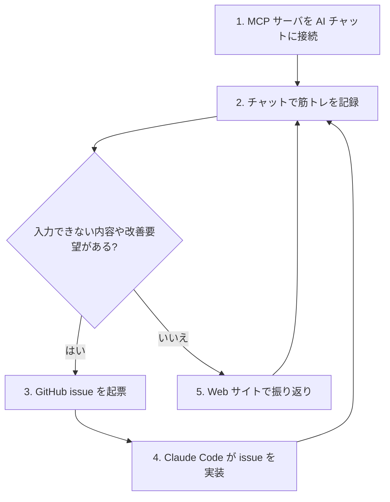

# 概要

## 背景と動機

筋トレの記録を紙のノートに手書きで管理している。記録の例:

- 「ウォーキング 10分 x 0.5% x 3.5~5.0km」
- 「アダクター 20x2s 50LBS 45LBS」
- 「レッグレイズ 計画20x2s → 実績20/10/10、メモ: 肩を上げない」

この運用は手軽だが、以下の課題がある:

- **振り返りが困難**: 過去の記録をめくって比較するのが面倒。種目別の推移が見えない
- **構造化されていない**: 重量・回数・セット数がテキストに混在し、集計できない
- **怪我への配慮が見えにくい**: 左足首・膝に怪我歴があり、種目ごとの負荷推移を把握して無理のないトレーニングを継続したい

一方で、手書きノートの写真を LLM に送れば構造化データに変換できることに気づいた。MCP（Model Context Protocol）を使えば、普段使っている ChatGPT や Claude のチャットから直接データベースに記録を登録できる。入力の手間を最小限にしつつ、デジタルの利点（検索・集計・可視化）を得られるシステムを構築する。

## ユーザーフロー

### ステップ 1: MCP サーバを AI チャットに接続

ChatGPT（Developer Mode Connector）、claude.ai（Custom Connector）、または Claude Desktop（mcp-remote ブリッジ）に本システムの MCP エンドポイントを登録する。接続先は `POST /mcp`（Streamable HTTP）。各クライアントの接続手順は [mcp-server.md](./mcp-server.md) を参照。

- ChatGPT: [Developer Mode での MCP 接続](https://developers.openai.com/api/docs/mcp)（remote HTTPS 必須、認証なしモードで登録可）
- claude.ai: [Custom Connector](https://support.claude.com/en/articles/11175166-get-started-with-custom-connectors-using-remote-mcp)（公開 HTTPS 必須、Free プランでも 1 個まで登録可）

### ステップ 2: チャットで筋トレを記録

ユーザーは自然言語で筋トレ内容を伝える。テキストでも、手書きノートの写真でもよい。

- 「今日はシーテッドロウ 16kg 15回2セットやった」
- 「（ノートの写真を添付して）これを記録して」

LLM が内容を解釈し、MCP ツール `log_workout` を呼び出してデータベースに登録する。未登録の種目は `register_exercise` で自動登録される。

### ステップ 3: GitHub issue を起票

記録できない情報（例: 心拍数）や改善要望がある場合、チャットクライアント側の GitHub MCP コネクタや `gh` CLI で GitHub issue を起票する。

- 「心拍数も記録したい。要望として issue 立てて」
- 「種目のカテゴリ分けがほしい」

これにより、アプリ自体がフィードバックループで進化する。

### ステップ 4: Claude Code が issue を実装

起票された issue を Claude Code（別セッション）が読み取り、feature ブランチで実装する。PR → CI → merge → 自動デプロイのサイクルで本番に反映される。これが issue 駆動開発の流れ。詳細は [development.md](./development.md) を参照。

### ステップ 5: Web サイトで振り返り

ブラウザから Web UI にアクセスし、過去の記録を閲覧する。種目別の重量推移チャート、セッション一覧、詳細表示が利用できる。Web UI は読み取り専用のビューアであり、記録の入力はすべてチャット経由で行う。詳細は [web-ui.md](./web-ui.md) を参照。

## 技術選定サマリ

| カテゴリ | 選定 | 備考 |
|---|---|---|
| ランタイム | Cloudflare Workers | ステートレス、エッジ実行 |
| フレームワーク | Hono v4.x | MCP / REST / SSR を単一 Worker で統合 |
| データベース | Cloudflare D1 | エッジ SQLite、無料枠で十分 |
| MCP SDK | `@modelcontextprotocol/sdk` v1.30.x | Streamable HTTP（ステートレス） |
| Web UI | Hono JSX (SSR) + htmx | SPA 不使用。読み取り専用ビューア |
| 言語 | TypeScript (strict) | |

技術選定の詳細な根拠と却下した代替案は [architecture.md](./architecture.md) を参照。

## スコープ

### Phase 1: 基盤 + MCP 最小構成

- D1 スキーマ設計・マイグレーション
- MCP サーバ実装（6 ツール）
- ChatGPT / claude.ai からの接続確認
- CI（型チェック・lint・テスト）

### Phase 2: Web UI

- SSR ページ実装（セッション一覧・詳細・種目別推移）
- htmx による部分更新
- Chart.js による推移チャート

### Phase 3: 運用改善

- CD パイプライン（merge → 自動デプロイ）
- E2E テスト
- ドキュメント追従の自動化

各フェーズの詳細なタスクと優先順位は [roadmap.md](./roadmap.md) を参照。

## 非スコープ

以下は現時点では対象外とする:

- **複数ユーザー対応**: 個人利用に限定
- **食事記録**: トレーニング記録に集中する
- **ネイティブアプリ**: Web UI + AI チャットで十分

### 将来検討

- OAuth 2.1 化（`@cloudflare/workers-oauth-provider` による標準的な MCP 認証）
- 体重記録の追加
- 心拍数・有酸素運動メトリクスの拡充
