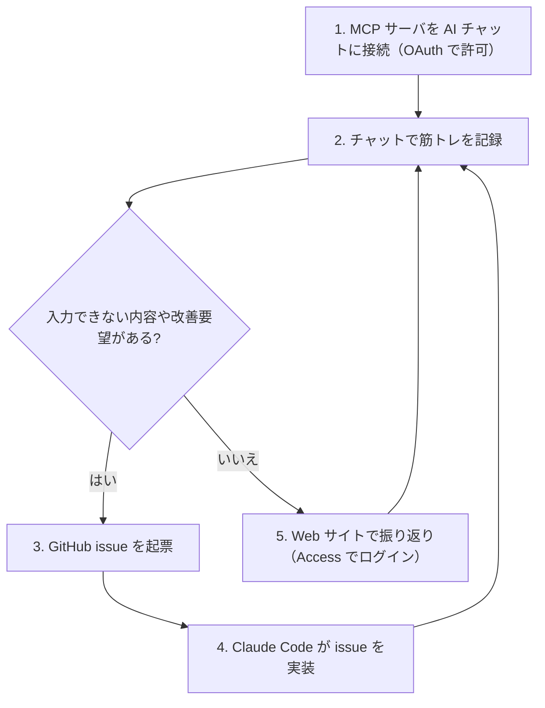

# 概要

## 背景と動機

筋トレの記録を紙のノートに手書きで管理している。記録の例:

- 「ウォーキング 10分 x 0.5% x 3.5~5.0km」
- 「アダクター 20x2s 50LBS 45LBS」
- 「レッグレイズ 計画20x2s → 実績20/10/10、メモ: 肩を上げない」

この運用は手軽だが、以下の課題がある:

- **振り返りが困難**: 過去の記録をめくって比較するのが面倒。種目別の推移が見えない
- **構造化されていない**: 重量・回数・セット数がテキストに混在し、集計できない
- **怪我への配慮が見えにくい**: 左足首・膝に怪我歴があり、種目ごとの負荷推移を把握して無理のないトレーニングを継続したい

一方で、手書きノートの写真を LLM に送れば構造化データに変換できることに気づいた。MCP（Model Context Protocol）を使えば、普段使っている ChatGPT や Claude のチャットから直接データベースに記録を登録できる。入力の手間を最小限にしつつ、デジタルの利点（検索・集計・可視化）を得られるシステムを構築する。

## ユーザーフロー

```mermaid
flowchart TD
    A["1. MCP サーバを AI チャットに接続（OAuth で許可）"] --> B["2. チャットで筋トレを記録"]
    B --> C{"入力できない内容や改善要望がある?"}
    C -->|はい| D["3. GitHub issue を起票"]
    D --> E["4. Claude Code が issue を実装"]
    E --> B
    C -->|いいえ| F["5. Web サイトで振り返り（Access でログイン）"]
    F --> B
```

### ステップ 1: MCP サーバを AI チャットに接続

ChatGPT（Developer Mode Connector）、claude.ai（Custom Connector）、または Claude Desktop（リモートコネクタ推奨、または mcp-remote ブリッジ）に本システムの MCP エンドポイントを登録する。接続先は `POST /mcp`（Streamable HTTP）。`/mcp` は OAuth 2.1 で保護されており、接続時にブラウザで `/authorize` が開く。Cloudflare Access にログインし、同意画面で要求 scope を確認して許可すると access token が発行される。各クライアントの接続手順は [mcp-server.md](./mcp-server.md) を参照。

- ChatGPT: [Developer Mode での MCP 接続](https://developers.openai.com/api/docs/mcp)（remote HTTPS 必須）
- claude.ai: [Custom Connector](https://support.claude.com/en/articles/11175166-get-started-with-custom-connectors-using-remote-mcp)（公開 HTTPS 必須、Free プランでも 1 個まで登録可）

### ステップ 2: チャットで筋トレを記録

ユーザーは自然言語で筋トレ内容を伝える。テキストでも、手書きノートの写真でもよい。

- 「今日はシーテッドロウ 16kg 15回2セットやった」
- 「（ノートの写真を添付して）これを記録して」

LLM が内容を解釈し、MCP ツール `log_workout` を呼び出してデータベースに登録する。未登録の種目は `log_workout` が自動登録する（明示的に `register_exercise` で登録することもできる）。

### ステップ 3: GitHub issue を起票

記録できない情報（例: 心拍数）や改善要望がある場合、MCP ツール `create_feedback` で GitHub issue を起票する（`GITHUB_TOKEN` 未設定時は手動起票用の URL が返る）。チャットクライアント側の GitHub MCP コネクタや `gh` CLI でも起票できる。

- 「心拍数も記録したい。要望として issue 立てて」
- 「種目のカテゴリ分けがほしい」

これにより、アプリ自体がフィードバックループで進化する。

### ステップ 4: Claude Code が issue を実装

起票された issue を Claude Code（別セッション）が読み取り、feature ブランチで実装する。PR → CI → merge → 自動デプロイのサイクルで本番に反映される。これが issue 駆動開発の流れ。詳細は [development.md](./development.md) を参照。

### ステップ 5: Web サイトで振り返り

ブラウザから Web UI にアクセスし、過去の記録を閲覧する。Cloudflare Access でログインしたアカウントに紐づく記録だけが表示される。種目別の重量推移チャート、セッション一覧、詳細表示に加え、鍛えた部位を Human Atlas の 3D 表示で確認できる。Web UI は読み取り専用のビューアであり、記録の入力はすべてチャット経由で行う（セッション写真の追加・削除のみ Web UI から可能）。詳細は [web-ui.md](./web-ui.md) を参照。

## 技術選定サマリ

| カテゴリ | 選定 | 備考 |
|---|---|---|
| ランタイム | Cloudflare Workers | ステートレス、エッジ実行 |
| フレームワーク | Hono v4.x | MCP / REST / SSR を単一 Worker で統合 |
| データベース | Cloudflare D1 | エッジ SQLite、無料枠で十分 |
| ブラウザ認証 | Cloudflare Access | Web UI / REST API を deny-by-default で保護 |
| MCP 認可 | `@cloudflare/workers-oauth-provider`（OAuth 2.1 + PKCE + CIMD） | 上流 IdP は Cloudflare Access。KV `OAUTH_KV` に grant / token を保存 |
| ユーザー識別 | 内部 `users.id`（`users` / `user_identities`） | 外部 IdP の `sub` を直接使わない |
| MCP SDK | `@modelcontextprotocol/sdk` v1.30.x | Streamable HTTP（ステートレス） |
| Web UI | Hono JSX (SSR) + htmx | SPA 不使用。読み取り専用ビューア |
| 言語 | TypeScript (strict) | |

技術選定の詳細な根拠と却下した代替案は [architecture.md](./architecture.md) を参照。

## スコープ

### Phase 1: 基盤 + MCP 最小構成

- D1 スキーマ設計・マイグレーション
- MCP サーバ実装（CRUD 6 ツール。後に写真 2・Atlas 筋肉管理 2・フィードバック 1 を追加し計 11 ツール）
- ChatGPT / claude.ai からの接続確認
- CI（型チェック・lint・テスト）

### Phase 2: Web UI

- SSR ページ実装（セッション一覧・詳細・種目別推移・種目一覧）
- htmx による部分更新
- Chart.js による推移チャート

### Phase 3: 運用改善

- CD パイプライン（Cloudflare Workers Builds による Git 連携で merge → 自動デプロイ）
- E2E 検証（実データ投入と Web UI 表示確認）
- ドキュメント追従の最終化

### 以降: 複数アカウント対応（Issue #66）

個人利用から招待制の複数ユーザー利用へ広げるため、ログイン機構とデータ分離を追加した。

- Web / REST を Cloudflare Access で保護し、Access の `sub` を内部 `users.id` に解決する
- `/mcp` を OAuth 2.1（`@cloudflare/workers-oauth-provider`）で保護し、上流 IdP を Access に統一する
- `users` / `user_identities` を新設し、`workout_sessions` などユーザーデータを `user_id` で分離する
- 招待制（許可リスト）。オーナーが `user_identities` に招待行を投入したアカウントだけがログインできる

各フェーズの詳細なタスクと優先順位は [roadmap.md](./roadmap.md) を参照。

## 非スコープ

以下は現時点では対象外とする:

- **自由登録・セルフサインアップ**: 招待制のみ。Access のポリシーに追加したアカウントだけが利用できる
- **食事記録**: トレーニング記録に集中する
- **ネイティブアプリ**: Web UI + AI チャットで十分

### 将来検討

- 体重記録の追加
- 心拍数・有酸素運動メトリクスの拡充
