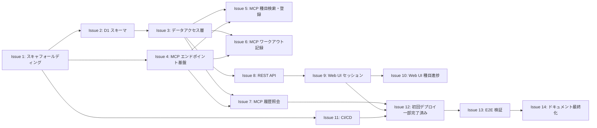

# ロードマップ

## 概要

本プロジェクトは 3 つの Phase で段階的に構築する。各 Phase の Issue は依存関係に従って順に実装し、依存のない Issue は並列に進めることができる。

各 Issue は本ファイルの記述を正として GitHub に起票される。Issue 本文中の依存参照（「Issue N（タイトル）」形式）は、GitHub 起票時に実際の Issue 番号に置換する。GitHub へ起票する際は各 issue 本文の `####` 見出しを `##` に変換する。

Issue 11 完了までは CI が存在しないため、PR は手元で `pnpm run typecheck` / `lint` / `test` を実行して確認したうえで merge する。

- **Phase 1** -- 基盤構築: プロジェクト初期化からデータモデル、MCP ツール全6種の実装まで
- **Phase 2** -- Web UI: REST API と 4 画面の SSR 実装
- **Phase 3** -- 運用基盤: CI/CD、本番デプロイ、E2E 検証、ドキュメント最終化

## 依存関係図

## 並列実行可能なグループ

| グループ | 前提条件 | 並列実行可能な Issue |
|----------|----------|---------------------|
| Group A | Issue 1 完了後 | Issue 2, Issue 4, Issue 11 |
| Group B | Issue 2 完了後 | Issue 3 |
| Group C-a | Issue 3 + Issue 4 完了後 | Issue 5, Issue 6, Issue 7 |
| Group C-b | Issue 3 完了後 | Issue 8 |
| Group D | Issue 8 完了後 | Issue 9 |
| Group E | Issue 9 完了後 | Issue 10 |
| Group F | Issue 7 + Issue 9 + Issue 11 完了後 | Issue 12 |
| Group G | Issue 12 完了後 | Issue 13, その後 Issue 14 |

---

## Phase 1: 基盤構築

### Issue 1: プロジェクトスキャフォールディング

**Phase**: 1 / **ラベル**: `phase-1`

#### 背景

空リポジトリに TypeScript + Cloudflare Workers + Hono の開発基盤を構築する。以降の全 Issue の前提となる。

#### スコープ

- [ ] pnpm 初期化（`package.json` 作成）
- [ ] 依存パッケージの導入: `hono`, `@modelcontextprotocol/sdk@^1.30`, `zod`, `wrangler`, `typescript`, `@biomejs/biome`, `vitest`, `@cloudflare/vitest-pool-workers`, `@cloudflare/workers-types`
- [ ] `tsconfig.json`（strict モード、Workers 向け設定）
- [ ] `biome.json`
- [ ] `vitest.config.ts`
- [ ] `wrangler.jsonc`（[docs/deployment.md](./deployment.md) の内容に準拠）
- [ ] `src/index.ts`（Hono app + `GET /health` エンドポイントのみ）
- [ ] `src/env.ts`（Bindings 型定義: `DB`）
- [ ] `package.json` scripts: `dev`, `deploy`, `typecheck`, `lint`, `format`, `test`
- [ ] `.gitignore`（`node_modules`, `.wrangler`, `dist`）
- [ ] `public/` ディレクトリと `migrations/` ディレクトリの placeholder

#### 非スコープ

- D1 スキーマ定義
- MCP エンドポイント
- REST API
- Web UI

#### 受け入れ条件

- [ ] `pnpm install` が成功する
- [ ] `pnpm run typecheck` が通過する
- [ ] `pnpm run lint` が通過する
- [ ] `pnpm run test` が通過する（テスト 0 件でも可）
- [ ] `wrangler dev` で起動し、`GET /health` が 200 を返す

#### 参照

- [docs/architecture.md](./architecture.md)（技術スタック、リポジトリ構成）
- [docs/deployment.md](./deployment.md)（wrangler.jsonc）
- <https://developers.cloudflare.com/workers/testing/vitest-integration/>（@cloudflare/vitest-pool-workers の公式ガイド）

---

### Issue 2: D1 スキーマとマイグレーション

**Phase**: 1 / **ラベル**: `phase-1`

#### 背景

データモデルを D1 に実装する。全機能の基盤となるテーブル定義。

#### スコープ

- [ ] `migrations/0001_initial_schema.sql`（[docs/database.md](./database.md) の DDL 全文: `exercises`, `exercise_aliases`, `workout_sessions`, `session_exercises`, `sets` + インデックス + CHECK 制約）
- [ ] `src/db/schema.ts`（DDL に対応する TypeScript 型: `Exercise`, `ExerciseAlias`, `WorkoutSession`, `SessionExercise`, `WorkoutSet`）
- [ ] ローカル D1 への適用確認
- [ ] `migrations/README.md`（マイグレーション運用手順）

#### 非スコープ

- CRUD 関数の実装
- シードデータの投入

#### 受け入れ条件

- [ ] `wrangler d1 migrations apply training-logger-db --local` が成功する
- [ ] TypeScript 型が DDL のテーブル定義と一致する
- [ ] FK 制約、UNIQUE 制約、CHECK 制約、インデックスが DDL に含まれる
- [ ] `pnpm run typecheck` が通過する

#### 参照

- [docs/database.md](./database.md)（DDL、テーブル定義）
- 依存 Issue: Issue 1（プロジェクトスキャフォールディング）

---

### Issue 3: データアクセス層の実装

**Phase**: 1 / **ラベル**: `phase-1`

#### 背景

MCP ツールと REST API が共用するデータアクセス関数を実装する。SQL を `src/db/` に一箇所に集約し、上位層は SQL を直接書かない設計とする。

#### スコープ

- [ ] `src/db/exercises.ts`
  - 検索: 名前完全一致 → alias 検索 → 部分一致の 3 段階解決（COLLATE NOCASE）
  - 種目登録 + 別名登録
  - ID 指定での取得
- [ ] `src/db/sessions.ts`
  - 日付指定での upsert（同日は既存セッションを返す）
  - ID / 日付での取得
  - 月別一覧 / 最新 N 件一覧
  - セッション削除
- [ ] `src/db/records.ts`
  - `session_exercises` の作成（`display_order` 自動採番）、更新、削除
  - `sets` の作成、全差し替え（既存削除 + 再挿入）、削除
- [ ] `src/db/queries.ts`
  - 種目別履歴（JOIN クエリ）
  - セッション詳細（JOIN クエリ）
  - 種目別統計（セッションごとの max weight / total reps）
- [ ] `test/db/` に 3 ファイル（exercises, sessions, records のテスト）

#### 非スコープ

- MCP ハンドラの実装
- REST ルーティングの実装

#### 受け入れ条件

- [ ] `test/db/` の全テストが通過する
- [ ] 別名（alias）での検索がヒットする
- [ ] 同日 upsert が既存セッションを返す
- [ ] `display_order` が一意に採番される
- [ ] セットの全差し替えが正しく動作する
- [ ] 全クエリが prepared statement（`.bind()`）を使用している
- [ ] `pnpm run typecheck` と `pnpm run lint` が通過する

#### 参照

- [docs/database.md](./database.md)（検索ロジック、テーブル定義）
- 依存 Issue: Issue 2（D1 スキーマとマイグレーション）

---

### Issue 4: MCP エンドポイント基盤

**Phase**: 1 / **ラベル**: `phase-1`

#### 背景

ChatGPT / claude.ai からの接続口となる MCP エンドポイントを構築する。ツール登録の枠組みを整え、個別のツール実装は Issue 5-7 で行う。

#### スコープ

- [ ] `src/mcp/handler.ts`
  - `POST /mcp` ルート
  - JSON-RPC 処理: `initialize`（protocolVersion `2025-11-25`）/ `tools/list` / `tools/call`
  - `GET /mcp` は 405 を返す
- [ ] `src/mcp/server.ts`
  - `McpServer` の生成とツール登録の集約（この時点では空）
  - 空でも `tools/list` が `[]` を返す
- [ ] `src/index.ts` へのルート統合

#### 非スコープ

- 個別の MCP ツール実装
- OAuth 認証

#### 受け入れ条件

- [ ] curl で `POST /mcp` に対して `initialize` が正常応答を返す
- [ ] `GET /mcp` で 405 が返る
- [ ] `tools/list` が `[]`（空配列）を返す
- [ ] `pnpm run typecheck` と `pnpm run lint` が通過する

#### 参照

- [docs/mcp-server.md](./mcp-server.md)（エンドポイント、プロトコル）
- [docs/architecture.md](./architecture.md)（認証設計）
- 依存 Issue: Issue 1（プロジェクトスキャフォールディング）

---

### Issue 5: MCP ツール - 種目検索・登録

**Phase**: 1 / **ラベル**: `phase-1`

#### 背景

MCP 経由で種目の検索と新規登録を行うツールを実装する。

#### スコープ

- [ ] `src/mcp/tools/search-exercises.ts`（Zod スキーマは [docs/mcp-server.md](./mcp-server.md) 準拠）
- [ ] `src/mcp/tools/register-exercise.ts`（Zod スキーマは [docs/mcp-server.md](./mcp-server.md) 準拠）
- [ ] `src/mcp/server.ts` へのツール登録
- [ ] `test/mcp/` に 2 ファイル
  - 部分一致検索
  - 別名検索
  - カテゴリフィルタ
  - 0 件ヒット
  - 重複登録エラー

#### 非スコープ

- ワークアウト記録ツール
- 履歴照会ツール

#### 受け入れ条件

- [ ] `tools/list` で `search_exercises` と `register_exercise` の 2 ツールが返る
- [ ] 別名での検索がヒットする
- [ ] 重複登録時に既存種目の情報付きエラーが返る
- [ ] 全テストが通過する

#### 参照

- [docs/mcp-server.md](./mcp-server.md)（ツール定義: `search_exercises`, `register_exercise`）
- 依存 Issue: Issue 3（データアクセス層の実装）, Issue 4（MCP エンドポイント基盤）

---

### Issue 6: MCP ツール - ワークアウト記録（log/update/delete）

**Phase**: 1 / **ラベル**: `phase-1`

#### 背景

コア機能。1 日分の複数種目・セットを一括登録するツール群を実装する。ノート写真から読み取った内容を ChatGPT / claude.ai 経由で一括登録するユースケースを想定。

#### スコープ

- [ ] `src/mcp/tools/log-workout.ts`
  - セッションの upsert（同日は既存に追記）
  - 未登録種目の自動登録 + カテゴリ推測
  - `display_order` の自動採番
  - セット登録
- [ ] `src/mcp/tools/update-workout.ts`
  - 対象の特定: `id` または 種目名 + `order`
  - フィールド更新
  - セットの全差し替え
- [ ] `src/mcp/tools/delete-workout.ts`
  - 個別の種目記録削除
  - セッション全体の削除
- [ ] `src/mcp/server.ts` へのツール登録
- [ ] `test/mcp/` に 3 ファイル。テストケースに手書きノート 2026-08-15、2026-08-16 の実データ（[docs/database.md](./database.md) のマッピング例）を使用

#### 非スコープ

- 種目検索・登録ツール（Issue 5）
- 履歴照会ツール（Issue 7）

#### 受け入れ条件

- [ ] 8/15 の全行が登録できる
- [ ] 8/16 の全行が登録できる（completed、計画 vs 実績、同日ウォーキング 2 回を含む）
- [ ] 同日への再呼び出しで追記される（上書きではない）
- [ ] セットの全差し替えが動作する
- [ ] 個別削除とセッション全体削除が動作する
- [ ] `date` 省略時に Asia/Tokyo の今日の日付が採用される（UTC と日付がズレる時間帯を想定したテストを含む）
- [ ] 全テストが通過する

#### 参照

- [docs/mcp-server.md](./mcp-server.md)（ツール定義: `log_workout`, `update_workout`, `delete_workout`）
- [docs/database.md](./database.md)（マッピング例: 2026-08-15, 2026-08-16）
- 依存 Issue: Issue 3（データアクセス層の実装）, Issue 4（MCP エンドポイント基盤）

---

### Issue 7: MCP ツール - 履歴照会

**Phase**: 1 / **ラベル**: `phase-1`

#### 背景

過去の記録を照会するツールを実装する。

#### スコープ

- [ ] `src/mcp/tools/get-history.ts`
  - 種目別の履歴照会
  - 期間指定（from / to）
  - 最新 N 件の取得
- [ ] `src/mcp/server.ts` へのツール登録
- [ ] `test/mcp/` にテストファイル

#### 非スコープ

- 種目検索・登録ツール（Issue 5）
- ワークアウト記録ツール（Issue 6）

#### 受け入れ条件

- [ ] 「前回のシーテッドロウ何 kg?」に相当する照会がデータを返す
- [ ] 最新 5 件の一覧が取得できる
- [ ] `tools/list` で全 6 ツールが返る
- [ ] 全テストが通過する

#### 参照

- [docs/mcp-server.md](./mcp-server.md)（ツール定義: `get_history`）
- 依存 Issue: Issue 3（データアクセス層の実装）, Issue 4（MCP エンドポイント基盤）

---

## Phase 2: Web UI

### Issue 8: REST API の実装

**Phase**: 2 / **ラベル**: `phase-2`

#### 背景

Web UI が使用する REST API エンドポイントを実装する。データアクセス層を活用し、フロントエンドに必要なデータを JSON で返す。

#### スコープ

- [ ] `src/api/routes.ts`（ルーティング定義）
- [ ] `src/api/sessions.ts`（セッション一覧・詳細）
- [ ] `src/api/exercises.ts`（種目一覧・詳細）
- [ ] `src/api/stats.ts`（種目別統計）
- [ ] [docs/web-ui.md](./web-ui.md) に定義された 5 エンドポイントの実装
- [ ] 曜日等の導出フィールドをサーバ側で `session_date` から算出して付与
- [ ] `src/index.ts` への統合
- [ ] `test/api/` に 2 ファイル

#### 非スコープ

- HTML レンダリング（Issue 9, 10）
- MCP ツールの追加・変更

#### 受け入れ条件

- [ ] 全エンドポイントが [docs/web-ui.md](./web-ui.md) の仕様どおりの JSON を返す
- [ ] 計画（`is_planned = 1`）と実績（`is_planned = 0`）が区別される
- [ ] `max_weight` の計算が正しい
- [ ] クエリパラメータ（`month`, `category`, `period` 等）のフィルタが動作する
- [ ] 全テストが通過する

#### 参照

- [docs/web-ui.md](./web-ui.md)（REST API エンドポイント一覧）
- 依存 Issue: Issue 3（データアクセス層の実装）

---

### Issue 9: Web UI - セッション一覧・詳細

**Phase**: 2 / **ラベル**: `phase-2`

#### 背景

Web UI のメイン画面であるセッション一覧と詳細ページを実装する。共通レイアウトもここで構築する。

#### スコープ

- [ ] `src/views/layout.tsx`（共通レイアウト: HTML head、htmx CDN 読み込み、ヘッダー、フッター）
- [ ] `src/views/sessions-list.tsx`（セッション一覧ページ）
- [ ] `src/views/session-detail.tsx`（セッション詳細ページ）
- [ ] `src/views/components/session-card.tsx`（セッションカードコンポーネント）
- [ ] `src/views/components/set-table.tsx`（セット表示テーブルコンポーネント）
- [ ] ルート `GET /` と `GET /sessions/:id` の実装
- [ ] `public/css/style.css`（モバイルファースト CSS）
- [ ] htmx による月切り替えの部分更新

#### 非スコープ

- 種目一覧・進捗ページ（Issue 10）
- Chart.js グラフ表示（Issue 10）

#### 受け入れ条件

- [ ] セッション一覧が正しく表示される
- [ ] 月ナビゲーションで htmx 部分更新が動作する
- [ ] 詳細ページで全種目・全セットが表示される
- [ ] 有酸素パラメータ（時間、傾斜、速度）が正しく表示される
- [ ] 計画 vs 実績が視覚的に区別できる
- [ ] 375px 幅で崩れない

#### 参照

- [docs/web-ui.md](./web-ui.md)（画面一覧: セッション一覧、セッション詳細）
- 依存 Issue: Issue 8（REST API の実装）

---

### Issue 10: Web UI - 種目別進捗・種目一覧

**Phase**: 2 / **ラベル**: `phase-2`

#### 背景

種目別の進捗グラフと種目一覧ページを実装する。Chart.js による折れ線グラフ表示を含む。

#### スコープ

- [ ] `src/views/exercise-progress.tsx`（種目別進捗ページ）
- [ ] `src/views/exercises-list.tsx`（種目一覧ページ）
- [ ] `src/views/components/chart.tsx`（Chart.js データ埋め込みコンポーネント）
- [ ] `public/js/chart-init.js`（SSR 埋め込み JSON から Chart.js 描画を初期化）
- [ ] ルート `GET /exercises` と `GET /exercises/:id` の実装
- [ ] 期間フィルタの htmx 部分更新

#### 非スコープ

- セッション一覧・詳細ページ（Issue 9）
- Web UI からの編集機能

#### 受け入れ条件

- [ ] 筋力系種目で最大重量の折れ線グラフが表示される
- [ ] 有酸素系種目で最大速度の折れ線グラフが表示される
- [ ] 期間フィルタ（1ヶ月/3ヶ月/6ヶ月/全期間）が htmx で動作する
- [ ] 種目一覧でカテゴリタブが動作する
- [ ] Chart.js は CDN から読み込まれ、バンドルに含まれない

#### 参照

- [docs/web-ui.md](./web-ui.md)（画面一覧: 種目別進捗、種目一覧）
- 依存 Issue: Issue 9（Web UI - セッション一覧・詳細）

---

## Phase 3: 運用基盤

### Issue 11: CI/CD パイプライン

**Phase**: 3 / **ラベル**: `phase-3`

#### 背景

GitHub Actions で CI/CD パイプラインを構築し、PR 時の自動チェックと main マージ時の自動デプロイを実現する。

#### スコープ

- [ ] `.github/workflows/ci.yml`（PR 時: typecheck + lint + D1 マイグレーション検証（`pnpm exec wrangler d1 migrations apply training-logger-db --local`）+ test）
- [ ] `.github/workflows/deploy.yml`（main push 時: チェック → `d1 migrations apply --remote` → `wrangler deploy`、`cloudflare/wrangler-action@v3` 使用）
- [ ] `.github/ISSUE_TEMPLATE/feature-request.md`（[docs/development.md](./development.md) の Issue 記述規約に準拠）

> **ユーザー操作**: GitHub リポジトリの Settings > Secrets and variables > Actions に以下を設定する:
>
> - `CLOUDFLARE_API_TOKEN`
> - `CLOUDFLARE_ACCOUNT_ID`
>
> 設定手順は PR 説明に記載する。

#### 非スコープ

- アプリケーションコードの実装
- Cloudflare Access の設定

#### 受け入れ条件

- [ ] PR 作成時に CI が自動実行され、全チェックが通過する
- [ ] main マージ時に自動デプロイが実行される（Secrets 設定後）
- [ ] Issue テンプレートが機能する

#### 参照

- [docs/deployment.md](./deployment.md)（CI/CD）
- [docs/development.md](./development.md)（Issue 記述規約）
- 依存 Issue: Issue 1（プロジェクトスキャフォールディング）。他の Issue と並列実行可能

---

### Issue 12: 初回デプロイ

**Phase**: 3 / **ラベル**: `phase-3`

> **注記**: D1 データベースの作成と初回デプロイは PR #19 で完了済み。残作業はマイグレーション適用と疎通確認のみ。

#### 背景

本番環境を構築し、動作確認を行う。

#### スコープ

- [x] `wrangler d1 create training-logger-db` → `database_id` を `wrangler.jsonc` に反映（完了済み）
- [ ] `wrangler d1 migrations apply training-logger-db --remote`
- [x] `wrangler deploy`（完了済み）
- [ ] 疎通確認一式

#### 非スコープ

- アプリケーションコードの変更
- 新機能の追加

#### 受け入れ条件

- [ ] `GET /health` が 200 を返す
- [ ] `POST /mcp` で MCP `initialize` が成功する
- [ ] ブラウザで `/` にアクセスすると Web UI が表示される

#### 参照

- [docs/deployment.md](./deployment.md)（初期構築手順）
- 依存 Issue: Issue 7（MCP ツール - 履歴照会）, Issue 9（Web UI セッション一覧・詳細）, Issue 11（CI/CD パイプライン）

---

### Issue 13: E2E 検証 - 手書きノート実データ投入

**Phase**: 3 / **ラベル**: `phase-3`

#### 背景

設計の最終検証として、手書きノートの実データを実際に登録し、Web UI で正しく表示されることを確認する。

#### スコープ

- [ ] `scripts/seed-test-data.ts`（8/15・8/16 のデータを `log_workout` 相当の処理で投入する検証スクリプト）
- [ ] **ユーザー操作**: ChatGPT または claude.ai に MCP コネクタを登録し、ノート写真から実際に登録操作を実施
- [ ] Web UI 表示確認チェックリストの実施
- [ ] 不具合が見つかった場合は Issue を起票

#### 非スコープ

- 新機能の追加
- パフォーマンスチューニング

#### 受け入れ条件

- [ ] 8/15 と 8/16 の全行が Web UI で正しく表示される
- [ ] 同日のウォーキング 2 回が別行として表示される
- [ ] レッグレイズの計画（20x2）vs 実績（20/10/10）が区別表示される
- [ ] カイザーの level 単位が正しく表示される
- [ ] 種目別進捗グラフが表示される
- [ ] `get_history` で前回の重量が正しく返る

#### 参照

- [docs/database.md](./database.md)（マッピング例: 2026-08-15, 2026-08-16）
- [docs/mcp-server.md](./mcp-server.md)（MCP 接続手順）
- 依存 Issue: Issue 12（初回デプロイと Cloudflare 設定）

---

### Issue 14: ドキュメントの実装追従・最終化

**Phase**: 3 / **ラベル**: `phase-3`

#### 背景

`docs/` は設計時点（実装前）に書かれている。実装完了後に現実との乖離を解消し、ドキュメントを最終化する。

#### スコープ

- [ ] 実装済みコードと `docs/` 全ファイルの突き合わせ
- [ ] README のクイックスタートを実機で検証して更新
- [ ] 本番 URL・実際のコマンド出力を反映
- [ ] 乖離箇所の修正

#### 非スコープ

- 新機能の設計追加
- スクリーンショットの追加

#### 受け入れ条件

- [ ] `docs/` の記述と実装が一致する
- [ ] クイックスタート手順を新規環境で再現可能
- [ ] 全ドキュメントのリンク切れがない

#### 参照

- `docs/` 全ファイル
- 依存 Issue: Issue 13（E2E 検証）

---

## 将来検討

以下は現時点では実装しない。必要性が明確になった時点で Issue を起票する。

- **OAuth 2.1 化**: `workers-oauth-provider` を使用した OAuth 認証への移行
- **MCP 2026-07-28 仕様追従**: MCP SDK のメジャーアップデートへの対応
- **体重・食事・心拍数記録**: 筋トレ記録以外のヘルスデータの取り込み
- **D1 バックアップの cron 自動化**: GitHub Actions の schedule トリガーによる定期エクスポート
- **Web UI からの編集機能**: PATCH/DELETE API + CSRF 保護の追加
- **複数ユーザー対応**: 対応しない（個人利用に限定）

## リスクと対策

| リスク | 影響 | 対策 |
|--------|------|------|
| MCP SDK v1 から v2 への移行 | ツール定義の書き換え | Zod スキーマは再利用可能。移行コストは低い |
| ChatGPT コネクタの仕様変更 | MCP 接続が壊れる | MCP 標準に準拠しているため影響は限定的。claude.ai がバックアップ |
| D1 無料枠の超過 | サービス停止 | 書き込みは 1 日数十行で上限の 0.1% 以下。監視不要 |
| Cloudflare Workers の互換性変更 | ランタイムエラー | `compatibility_date` の固定 + Renovate による依存の継続追従 |
